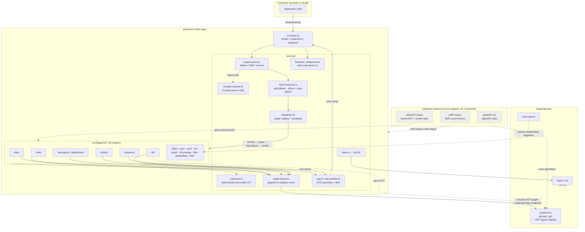

# System Architecture

High-level architecture of plantuml-ts and its coupling to graphviz-ts
and the upstream reference. Communication is **in-process, synchronous
function calls** unless labeled otherwise — there are no network hops,
services, or databases in the runtime path.

## Communication model

| Edge | Kind | Protocol / mechanism |
|------|------|----------------------|
| Consumer → `render`/`renderSync` | sync (async wrapper for includes) | direct function call |
| core → diagram plugins | sync | `DiagramPlugin` interface (`accepts`/`parse`/`layoutSync`/`render`) |
| graph plugins → graphviz-ts | sync | `graph-layout.ts` serializes a `DotInputGraph` into a graphviz-ts builder, runs an engine, reads back a `LayoutSnapshot` |
| dot plugin → graphviz-ts | sync | `parse()` (Peggy DOT grammar) |
| latex → KaTeX | sync | `renderToString` |
| async path → `IncludeFetcher` | **async** | injected `fetch`-like callback (CSP/CORS aware); only reachable via `render`, never `renderSync` |

## Architectural invariants

- **No DOM, no canvas, no async in the core transform.** Text width is
  resolved by a deterministic lookup table (`measurer.ts`), which is why
  layout is reproducible and server-safe. graphviz-ts is consumed
  through the same DOM-free contract.
- **Single layout seam.** All graph-topology diagrams reach graphviz-ts
  through exactly one adapter (`graph-layout.ts`); no plugin talks to
  the engine directly except the `dot` plugin's parser.
- **Plugin dispatch is order-sensitive.** The registry tries `accepts()`
  most-specific-first (object → class → state → description → activity →
  sequence); a graceful error-SVG sentinel handles no-match.
- **`CONTAINER_KINDS` is mirrored** in `layout.ts` and `renderer.ts` and
  must stay in sync; childless containers are treated as leaf nodes.
- **Upstream architecture is authoritative.** Engine/parser boundaries
  mirror upstream PlantUML; structural divergence is treated as a bug to
  re-mirror, not patch around.
