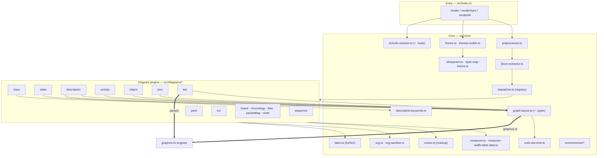
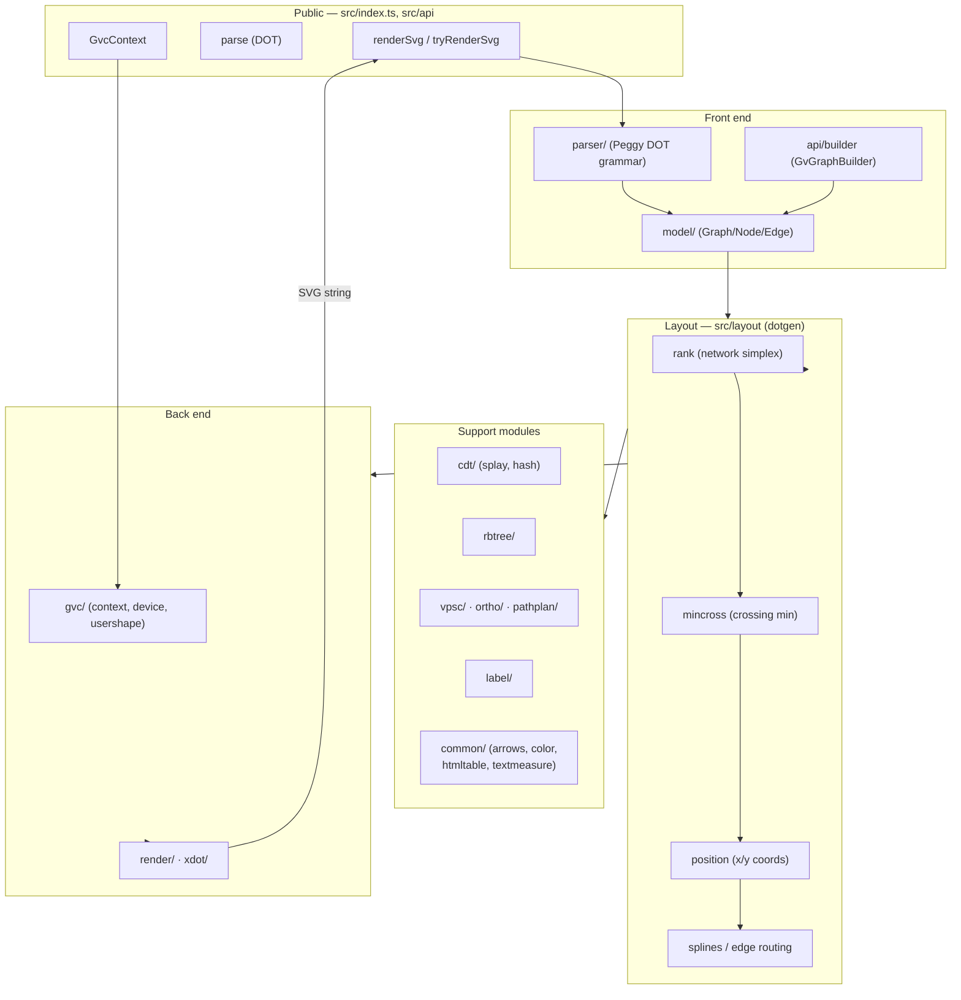

# Component Maps

Per-repo internal structure. plantuml-ts is shown in full; graphviz-ts
(the consumed layout engine) is shown at module granularity; the Java
upstream is summarized (reference-only, not built here).

## plantuml-ts

**Plugin contract** (`dispatcher.ts`): every plugin implements
`accepts(lines) → boolean`, `parse(source) → AST`,
`layoutSync(ast, theme, measurer) → Geo`, and `render(geo, theme) →
string`. All 15 current plugins expose `layoutSync` (so all are
`renderSync`-capable); the interface also permits async `layout` for a
future WASM/worker engine. Each plugin directory typically contains
`index.ts` (the plugin object), `parser.ts`/`ast.ts`, `layout.ts`, and
`renderer.ts`.

**Layout split:**
- *Own layout* — `sequence` (lifelines/messages), and the data-shape
  diagrams (`json`, `yaml`, `hcl`, `board`, `packetdiag`, `chart`,
  `files`, `chronology`) which compute geometry directly.
- *graphviz-ts layout* — graph-topology diagrams (`class`, `state`,
  `description`/deployment, `activity`, `object`, `dot`) route through
  `graph-layout.ts`.

## graphviz-ts

Faithful port of Graphviz 2.38's C modules, consumed by plantuml-ts.

Notable: **zero runtime dependencies**; text measurement is injectable
(`setTextMeasurer`) so it stays DOM-free, which is exactly how
plantuml-ts drives it (it injects its own deterministic measurer). The
DOT parser is generated from a Peggy grammar (`src/parser/dot.pegjs`).

## plantuml (upstream Java) — reference only

Not built in this workspace. Relevant packages under
`net.sourceforge.plantuml/` used as the porting spec:

- `sequencediagram/`, `classdiagram/`, `descdiagram/`,
  `componentdiagram/`, `activitydiagram3/` — parser + AST semantics.
- `command/` — the `Command*` classes that define per-keyword parsing.
- `klimt/` / `skin/` — rendering + skin parameter resolution.
- an embedded **Smetana** (Java transpile of Graphviz 2.38 C) — the
  same algorithm graphviz-ts ports, kept as a cross-check.

~3,656 `.java` files; treated as authoritative for both behavior and
engine/parser boundaries.
