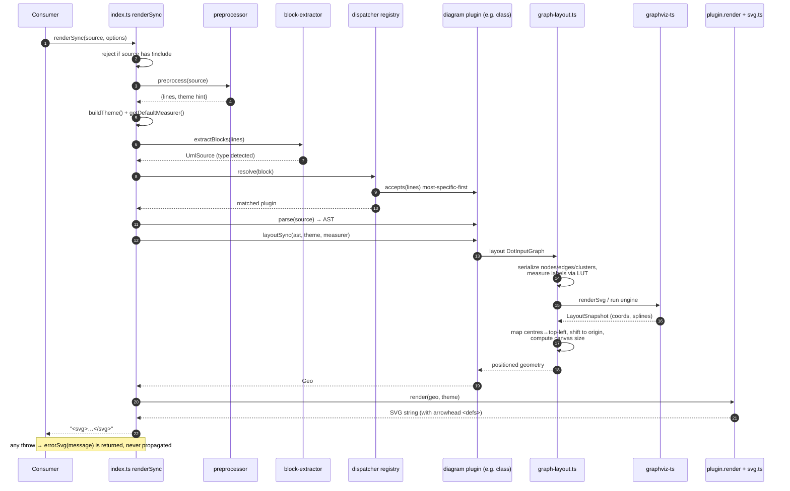
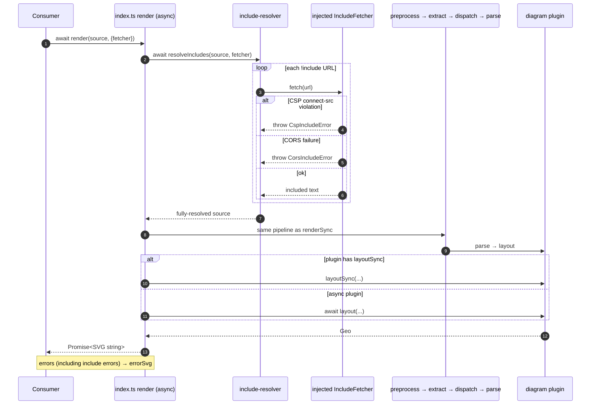
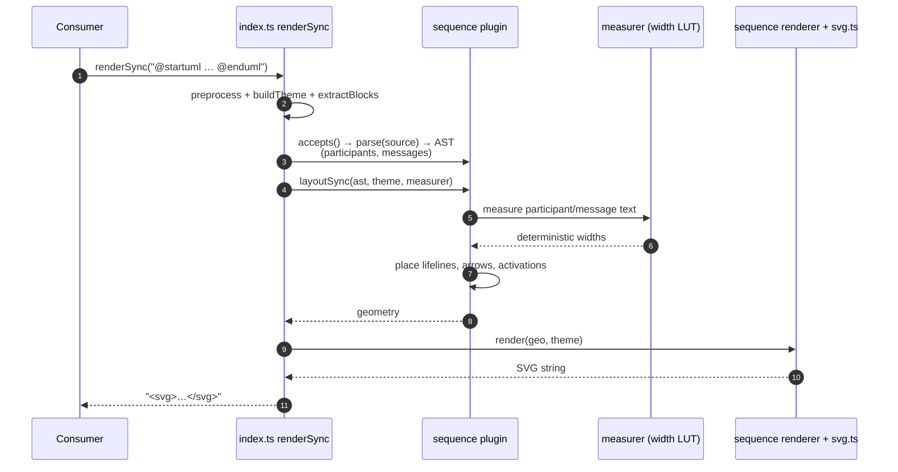

# Data Flows

Sequence diagrams for the most important flows, derived from
`src/index.ts` and `src/core/`. All steps are in-process synchronous
calls except where an `async`/`await` boundary is drawn explicitly.

## 1. `renderSync` of a graph-topology diagram (the graphviz-ts seam)

The critical path: a class/state/description/dot diagram that borrows
graphviz-ts for layout. This is the flow where most accumulated fidelity
lives.

## 2. `render` (async) with `!include` resolution

The only flow that touches the outside world. `renderSync` explicitly
rejects `!include`; the async `render` resolves includes first, then
runs the identical pipeline. A plugin without `layoutSync` (a future
WASM/worker engine) is `await`ed here.

## 3. `renderSync` of a self-laying-out diagram (sequence)

Contrast case: no graphviz-ts. Sequence (and the data-shape diagrams)
compute geometry directly from the AST, so the pipeline is shorter and
never crosses the layout seam.

## Why these three

- **Flow 1** exercises the single most complex and highest-value seam
  (graphviz-ts integration) and the full plugin contract.
- **Flow 2** is the only async/effectful path and the only place the
  library reaches outside the process — the security-relevant boundary
  (CSP/CORS-aware fetch injection).
- **Flow 3** shows the self-contained layout path, confirming graphviz-ts
  is a per-diagram-type dependency, not a global one.
