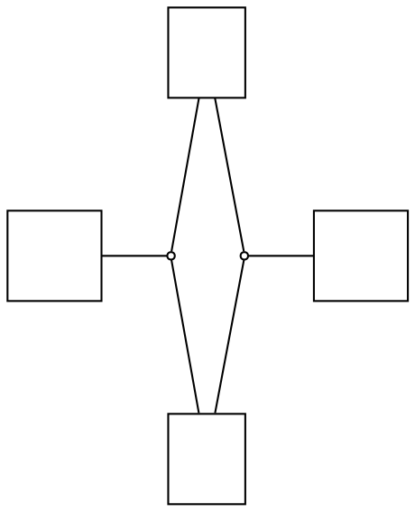

# `getLayout()` and `render()` disagree on edge splines (dominant)

**Impact:** the single largest blocker across the whole conformance
drill — ~288/718 class fixtures plus ~41 object fixtures carry the
`path/@d` family this feeds; dozens are otherwise byte-exact.

**Finding (g2 ledger N35):** for the SAME graph in the SAME process,
`getLayout()`'s edge points and `render()`'s emitted `<path d>` differ
by a ~0.03–0.06px x-drift and a non-constant y-drift. `render()`'s
values match real graphviz (and the PlantUML jar) exactly;
`getLayout()`'s do not. No API surface exists to get `render()`'s
spline computation as data (`dist/api/geometry.d.ts` — `getLayout(g,
opts)` has no option; ADR-1 keeps the internal Edge model private).

**What is NOT broken (falsified — don't chase):** node-position
assignment. On every graph tested, graphviz-ts node positions and
`render()`-emitted splines are **byte-identical** to real `dot -Tsvg`
(verified down to path `d` strings). The early "routing offset" theory
was falsified three separate times.

## Repro DOT

PlantUML fixture bunuce-10-vere519's svek-1.dot — an association-class
couple; the two `shape=circle` nodes are the couple points:

## Procedure

Build this graph via the builder API. Take edge sh0010→sh0009
(circle→rect). Compare `getLayout()`'s points for that edge against
the `<path d>` in `render(g,'svg')`'s output for the same edge
(normalize the root translate). Observed: getLayout x-values
`87.2373, 88.798, 96.8036, 101.8307` vs render's `87.18, 88.59,
96.68, 101.77`; render matches real `dot -Tsvg` byte-for-byte.

## Ask

Either works: make `getLayout()` return the same spline points
`render()` emits, or expose the render-side spline data via the API
(per-edge points at SVG precision). Consumer subtlety: PlantUML's jar
reads graphviz's SVG text, so values quantized to SVG output precision
are what byte-conformance needs.

## Evidence trail

`plans/g2-class-svg/ledger.md` §N35 (also N18, N25). Cross-check
harness pattern: rebuild the DOT via the builder API,
`render(g,'svg')`, compare against `dot -Tsvg` (graphviz 15.1,
`/opt/homebrew/bin/dot`) on the same text in identical SVG space.
