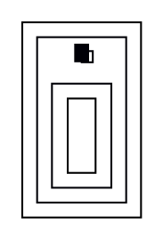

# Integer-vs-fractional node centering inside clusters

**Impact:** blocks strictuml/package fixtures; general sub-pixel
correctness for any cluster-nested node. With issue 01, unblocks the
majority of the gvts-blocked class/object fixtures.

**Finding (g2 ledger N61):** same DOT text → real dot resolves the
nested node's center to a fractional x (`32.32`, matching the jar);
graphviz-ts `getLayout()` resolves it to the exact integer `32`.
Node SIZE matches; only the sub-pixel position differs.

## Repro DOT

Fixture jinibe-02-tebi269's svek-1.dot — one node in a triple-nested
cluster with an HTML-table cluster label:

## Procedure

Run through real `dot -Tsvg` and graphviz-ts; compare sh0010's center
x. Real dot: 32.32. graphviz-ts: 32.00.

## Evidence trail

`plans/g2-class-svg/ledger.md` §N61.

---

**RESOLVED — graphviz-ts 0.1.26072013 (verified 2026-07-20).** Repro DOT
re-run through `renderSvg`/`getLayout` vs real `dot -Tsvg` (graphviz 15.1):
full SVG geometry stream byte-identical to real dot on the repro (sh0010
polygon at 32.32-fractional coords). Consumer-side adoption of HTML-table
cluster labels (production `addClusters` still passes plain-text labels) is
tracked as mission work, not a library defect.
