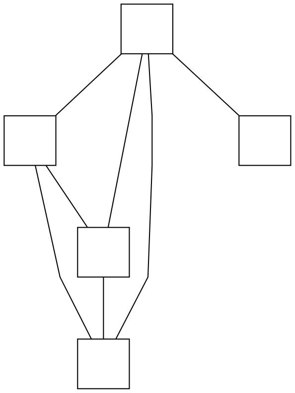

# No way to set the `splines` graph attribute

**Impact:** `skinparam linetype polyline` (and `ortho`) cannot be
expressed; the PlantUML jar emits `splines=polyline` in its DOT.

**Finding (g2 ledger N31):** the builder API has no `splines` setter
and `setAttr('splines', ...)` does not reach the engine's routing mode
(verified against `dist/api/builder.d.ts` and behavior).

## Repro DOT

Fixture kuxato-79-muno809's svek-1.dot, abridged — note line 6:

## Procedure

Real `dot -Tsvg` on this text produces polyline (straight-segment)
edges; graphviz-ts produces curved splines regardless.

## Ask

Honor/expose `splines` (`polyline` and `ortho` at minimum).

## Evidence trail

`plans/g2-class-svg/ledger.md` §N31.

---

**RESOLVED — graphviz-ts 0.1.26072013 (verified 2026-07-20).** Repro DOT
re-run through `renderSvg`/`getLayout` vs real `dot -Tsvg` (graphviz 15.1):
`splines=polyline` now honored — edge `sh0006->sh0008` path d byte-identical
to real dot. Production wiring of `skinparam linetype polyline` through the
seam is mission work.
