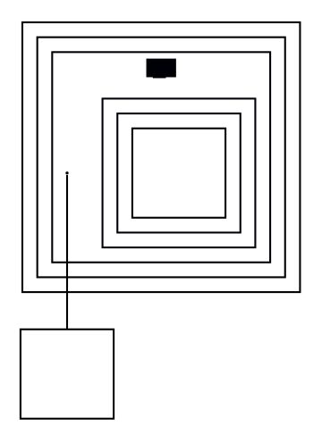

# Anchor-node rank assignment diverges from real dot

**Impact:** PlantUML's "anchor in cluster" pattern (a `shape=point`
node inside the cluster, used as a link target for the package
itself) lands on the wrong side of its sibling.

**Finding (g2 ledger N18, re-confirmed N60-61):** real graphviz ranks
the point-anchor ABOVE the sibling classifier; graphviz-ts ranks it
BELOW. Confirmed via direct `getLayout()` instrumentation; a
nodeIds-reorder experiment had zero effect (it is not input-order
sensitivity).

## Repro DOT

Fixture bajotu-30-soku184's svek-1.dot:

## Procedure

Compare `zaent0001`'s y relative to `sh0010` between real
`dot -Tplain`/`-Tsvg` and graphviz-ts. Real dot places the point above
sh0010 (~8px of extra cluster-top gap results, matching the jar's 41px
vs 33px package footprints); graphviz-ts places it below.

## Evidence trail

`plans/g2-class-svg/ledger.md` §N18, §N60-61.
