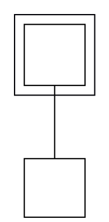

# `getLayout()` exposes no cluster geometry (mechanism 16)

**Impact:** the largest single residue family left in the whole
conformance drill — 92 state fixtures carry the entity-vs-cluster wrap
signature directly, plus the 20-fixture `<<entrypoint>>`/`<<exitpoint>>`
family it gates (any composite containing a border point is disqualified
from the port's `autonom` path and falls back to the cluster path), for
112 of G4's 219 non-conformant fixtures. Also blocks class/description
package-cluster refinements deferred in G2.

**Finding (g4 ledger §S1/S3/S6, three independent data points):** the
PlantUML jar sizes and draws a DOT-native composite (a svek cluster)
from graphviz's OWN computed cluster bounding box — graphviz's
subgraph-cluster layout adds content-dependent margins that are not a
fixed constant. Byte comparison of two single-child composites shows the
header-height constant recurs (19px on all three samples) but the side
margin does not (16px vs 24px, tracking child content shape) —
consistent only with real cluster-margin computation, not a derivable
constant. graphviz-ts computes this bbox correctly (its rendered SVG
cluster polygon is byte-identical to real dot — see Procedure), but the
public `getLayout()` snapshot exposes only `bounds`/`nodes`/`edges`, so
a geometry consumer cannot obtain it. plantuml-ts's layout seam
(`layoutGraph()`) consumes the snapshot; with no cluster entry it must
approximate composite wrap dimensions, and the approximation is provably
wrong per fixture.

## Repro DOT

Minimal single-child cluster with one outside peer (margins visible on
all four sides):

## Procedure

Verified 2026-07-21 on graphviz-ts 0.1.26072013 vs real `dot -Tsvg`
(graphviz 15.1, /opt/homebrew/bin/dot):

- real dot cluster polygon: `8,-100 8,-166 74,-166 74,-100 8,-100`
- graphviz-ts `renderSvg` cluster polygon: byte-identical
- `getLayout(g)` after layout: snapshot keys are exactly
  `['bounds','nodes','edges']`; the string `cluster` appears nowhere in
  the serialized snapshot.

So the engine computes the correct cluster bbox; only the API surface
withholds it.

## Ask

Add a `clusters` array to the `getLayout()` snapshot: per cluster, the
subgraph name (`cluster6`) and its bbox (x/y/width/height) in both
`yAxis` frames, matching the polygon `render()` emits at SVG precision
(the same consumer subtlety as issue 01: the jar reads graphviz's SVG
text, so SVG-precision values are what byte-conformance needs). Nested
clusters should each get their own entry; parent linkage (or the raw
name, which encodes it) is sufficient.

## Workaround note

The bbox IS present in `render()`'s SVG text (`class="cluster"`
polygons), so plantuml-ts could extract it via its sanctioned SVG-text
channel in the interim — but the snapshot is the production seam, and
per-cluster identity mapping via `<title>` text is exactly the kind of
parsing ADR-1 was meant to make unnecessary.

## Evidence trail

`plans/g4-state-svg/ledger.md` §S6 ("Mechanism 16 … re-confirmed
unbounded", the 16-vs-24 margin data), §S15 (the
`hasBorderPointDescendant` gate over the entrypoint/exitpoint family),
§S16 accounting (92 + 20 fixture attribution). Example fixtures:
decede-10-buvu414, gojuja-90-pune699, bajelo-54-dixe684.

---

**RESOLVED — graphviz-ts 0.1.26072115 (verified 2026-07-21).** The
`getLayout()` snapshot now includes a `clusters` array (`name`, `x`,
`y`, `width`, `height`). Verified against real `dot -Tsvg` on both
filed repros: the flat case returns cluster6 at 8,8 66×66 matching the
polygon exactly, and the triple-nested case exposes all three clusters
with dims byte-matching real dot's polygons (64×105 / 48×89 / 32×56),
correct in both `yAxis` frames. Float noise is ≤3.2e-5px — far inside
the ±0.01 conformance tolerance. Consumer-side adoption (layoutGraph
exposing cluster geometry + the state composite pipeline consuming it
— G4's mechanism 16, 92+20 fixtures) is mission work, tracked in the
G4 follow-up order. Repo bump to 0.1.26072115 lands at the next
iteration boundary of the in-flight G5 mission.
