# Demo App

A browser playground that renders one canonical example per diagram type. It
serves two purposes simultaneously: visual verification during development, and
a public showcase of what the library can do.

---

## Structure

```
demo/
  index.html          — single HTML file, loads app.ts
  app.ts              — wires up the UI: nav, editor, preview, error display
  style.css           — minimal layout styles (no framework)
  examples/
    sequence/         — one or more .puml files per type
    class/
    component/
    state/
    usecase/
    activity/
    object/
    timing/
    mindmap/
    gantt/
    wbs/
```

The demo is a second Vite entry point in the same repo. Running `pnpm dev`
starts both the library watch build and the demo dev server (using
`vite --config demo/vite.config.ts`).

---

## UI Layout

```
┌──────────────────────────────────────────────────────────────────┐
│  plantuml-js demo                              [theme: default ▾] │
├─────────────────┬────────────────────┬───────────────────────────┤
│  Sequence       │  PlantUML source   │  Rendered SVG             │
│  Class          │  ┌──────────────┐  │  ┌─────────────────────┐  │
│  Component      │  │ @startuml    │  │  │                     │  │
│  State          │  │ Alice -> Bob │  │  │  [live SVG output]  │  │
│  Use Case       │  │ @enduml      │  │  │                     │  │
│  Activity       │  └──────────────┘  │  └─────────────────────┘  │
│  Object         │                    │                           │
│  Timing         │  [error bar]       │  render time: 12ms        │
│  Mind Map       │                    │                           │
│  Gantt          │                    │                           │
│  WBS            │                    │                           │
└─────────────────┴────────────────────┴───────────────────────────┘
```

- **Left panel** — nav list, one entry per supported diagram type; clicking
  loads the canonical example into the editor and re-renders
- **Middle panel** — `<textarea>` with the PlantUML source; edits trigger a
  debounced re-render (200 ms)
- **Right panel** — live SVG output injected as `innerHTML`; if render throws,
  shows the error message in red instead
- **Theme selector** — dropdown: `default`, `dark`, `sketchy`, `monochrome`;
  switching re-renders immediately
- **Render time** — shows milliseconds taken for the last render call

### Keyboard shortcuts
- `Ctrl/Cmd + Enter` — force immediate re-render (bypasses debounce)

---

## Canonical Example Files

One `.puml` file per diagram type. These are the files loaded when a nav item
is clicked. They should showcase a realistic scenario, not a hello-world.

### `demo/examples/sequence/canonical.puml`

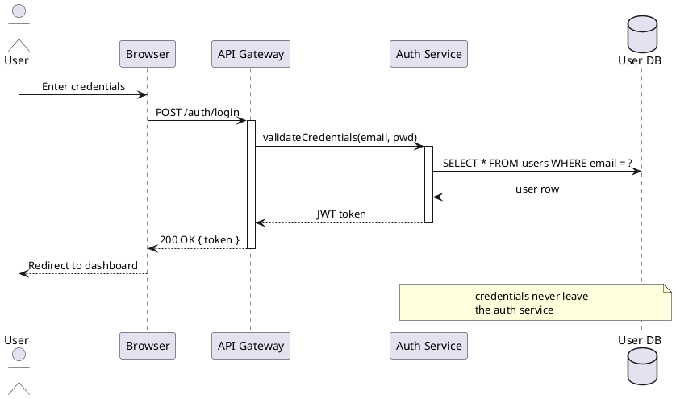

### `demo/examples/class/canonical.puml`

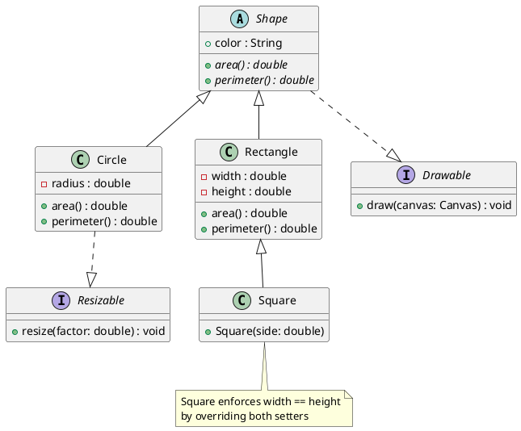

### `demo/examples/component/canonical.puml`

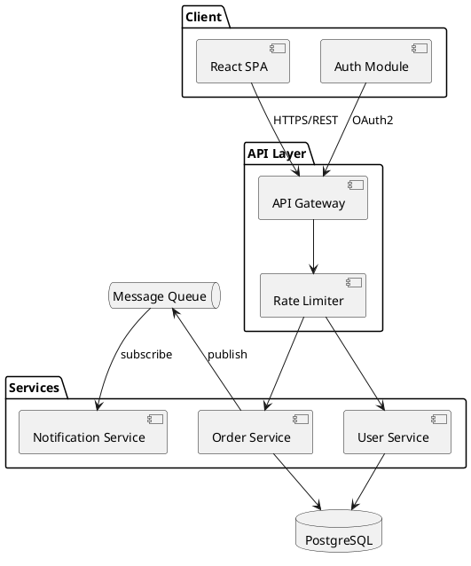

### `demo/examples/state/canonical.puml`

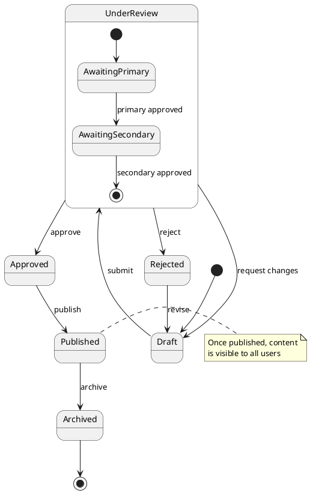

### `demo/examples/usecase/canonical.puml`

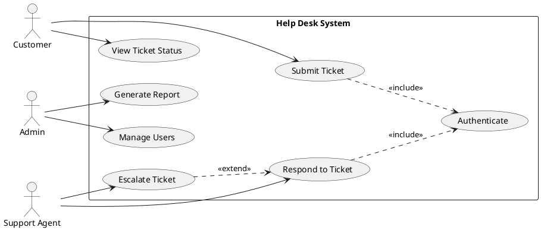

### `demo/examples/activity/canonical.puml`

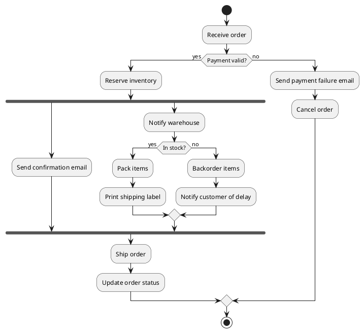

### `demo/examples/object/canonical.puml`

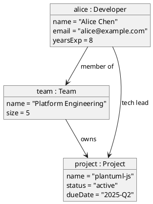

### `demo/examples/timing/canonical.puml`

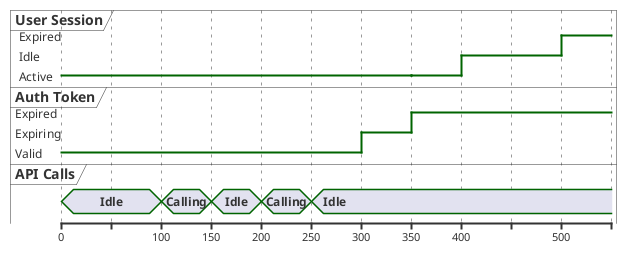

### `demo/examples/mindmap/canonical.puml`

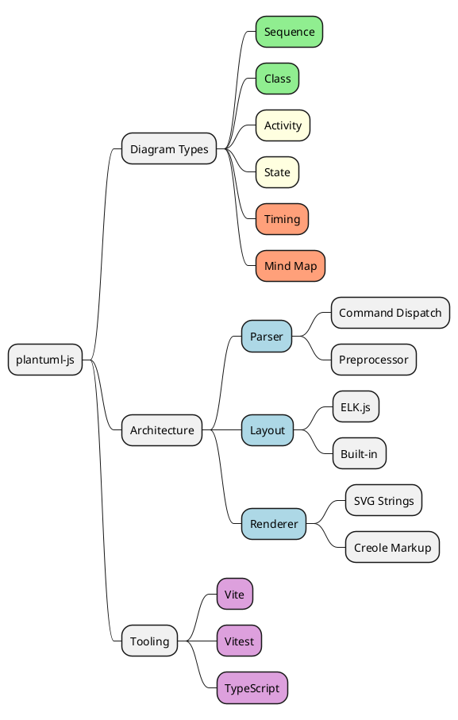

### `demo/examples/gantt/canonical.puml`

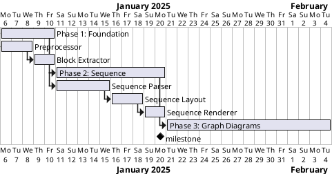

### `demo/examples/wbs/canonical.puml`

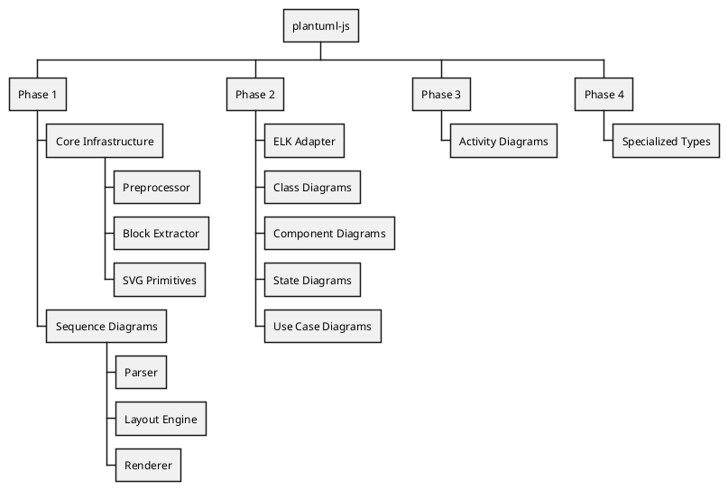

---

## Vite Config for Demo

```typescript
// demo/vite.config.ts
import { defineConfig } from 'vite';

export default defineConfig({
  root: 'demo',
  publicDir: 'examples',
  build: {
    outDir: '../dist-demo',
    emptyOutDir: true,
  },
  resolve: {
    alias: {
      'plantuml-js': '/src/index.ts',  // use live source, not dist
    },
  },
});
```

`resolve.alias` means the demo always runs against the latest source code, not
a published build. Breakage in the demo is breakage in the library.

---

## npm Scripts

```json
{
  "scripts": {
    "dev":          "vite --config demo/vite.config.ts",
    "build":        "vite build",
    "build:demo":   "vite build --config demo/vite.config.ts",
    "preview:demo": "vite preview --config demo/vite.config.ts",
    "test":         "vitest run",
    "test:watch":   "vitest",
    "coverage":     "vitest run --coverage",
    "typecheck":    "tsc --noEmit",
    "lint":         "eslint src demo tests"
  }
}
```

---

## Demo App Code Sketch

### `demo/index.html`

```html
<!DOCTYPE html>
<html lang="en">
<head>
  <meta charset="UTF-8">
  <title>plantuml-js demo</title>
  <link rel="stylesheet" href="style.css">
</head>
<body>
  <header>
    <h1>plantuml-js demo</h1>
    <select id="theme-select">
      <option value="default">default</option>
      <option value="dark">dark</option>
      <option value="sketchy">sketchy</option>
      <option value="monochrome">monochrome</option>
    </select>
  </header>
  <div id="layout">
    <nav id="type-nav"></nav>
    <div id="editor-pane">
      <textarea id="source" spellcheck="false"></textarea>
      <div id="error-bar" hidden></div>
    </div>
    <div id="preview-pane">
      <div id="svg-output"></div>
      <div id="render-time"></div>
    </div>
  </div>
  <script type="module" src="app.ts"></script>
</body>
</html>
```

### `demo/app.ts` (sketch)

```typescript
import { render } from 'plantuml-js';

const DIAGRAM_TYPES = [
  { id: 'sequence',  label: 'Sequence',   file: 'sequence/canonical.puml'  },
  { id: 'class',     label: 'Class',      file: 'class/canonical.puml'     },
  { id: 'component', label: 'Component',  file: 'component/canonical.puml' },
  { id: 'state',     label: 'State',      file: 'state/canonical.puml'     },
  { id: 'usecase',   label: 'Use Case',   file: 'usecase/canonical.puml'   },
  { id: 'activity',  label: 'Activity',   file: 'activity/canonical.puml'  },
  { id: 'object',    label: 'Object',     file: 'object/canonical.puml'    },
  { id: 'timing',    label: 'Timing',     file: 'timing/canonical.puml'    },
  { id: 'mindmap',   label: 'Mind Map',   file: 'mindmap/canonical.puml'   },
  { id: 'gantt',     label: 'Gantt',      file: 'gantt/canonical.puml'     },
  { id: 'wbs',       label: 'WBS',        file: 'wbs/canonical.puml'       },
] as const;

// Vite's ?raw import suffix gives us the file contents as a string
const examples = import.meta.glob('./examples/**/*.puml', { as: 'raw' });

let debounceTimer: ReturnType<typeof setTimeout>;
let currentTheme = 'default';

async function rerenderSource(source: string): Promise<void> {
  const t0 = performance.now();
  const errorBar = document.getElementById('error-bar')!;
  const svgOutput = document.getElementById('svg-output')!;
  const renderTime = document.getElementById('render-time')!;
  try {
    const svg = await render(source, { theme: currentTheme as any });
    svgOutput.innerHTML = svg;
    errorBar.hidden = true;
  } catch (err) {
    errorBar.textContent = String(err);
    errorBar.hidden = false;
  }
  renderTime.textContent = `render: ${(performance.now() - t0).toFixed(1)} ms`;
}

async function loadExample(file: string): Promise<void> {
  const loader = examples[`./examples/${file}`];
  const source = await loader();
  const textarea = document.getElementById('source') as HTMLTextAreaElement;
  textarea.value = source;
  await rerenderSource(source);
}

function buildNav(): void {
  const nav = document.getElementById('type-nav')!;
  for (const type of DIAGRAM_TYPES) {
    const btn = document.createElement('button');
    btn.textContent = type.label;
    btn.dataset.id = type.id;
    btn.addEventListener('click', () => {
      document.querySelectorAll('#type-nav button').forEach(b => b.classList.remove('active'));
      btn.classList.add('active');
      loadExample(type.file);
    });
    nav.appendChild(btn);
  }
}

function init(): void {
  buildNav();

  const textarea = document.getElementById('source') as HTMLTextAreaElement;
  textarea.addEventListener('input', () => {
    clearTimeout(debounceTimer);
    debounceTimer = setTimeout(() => rerenderSource(textarea.value), 200);
  });
  textarea.addEventListener('keydown', (e) => {
    if ((e.ctrlKey || e.metaKey) && e.key === 'Enter') {
      clearTimeout(debounceTimer);
      rerenderSource(textarea.value);
    }
  });

  const themeSelect = document.getElementById('theme-select') as HTMLSelectElement;
  themeSelect.addEventListener('change', () => {
    currentTheme = themeSelect.value;
    rerenderSource(textarea.value);
  });

  // Load first example on startup
  const firstBtn = document.querySelector<HTMLButtonElement>('#type-nav button');
  firstBtn?.click();
}

init();
```

---

## Relationship to Tests

The canonical example files double as integration test fixtures:

```typescript
// tests/integration/canonical-examples.test.ts

import { render } from '../../src/index';
import { readFileSync } from 'fs';
import { glob } from 'glob';

const canonicalFiles = glob.sync('demo/examples/**/*.puml');

for (const file of canonicalFiles) {
  it(`renders canonical example: ${file}`, async () => {
    const source = readFileSync(file, 'utf8');
    const svg = await render(source);
    expect(svg).toMatch(/^<svg/);
    expect(svg).toMatch(/<\/svg>$/);
  });
}
```

This means every canonical example is an automatically-run regression test.
Adding a new canonical file immediately adds a new test.

---

## When to Add Demo Examples

Each phase adds its diagram type's canonical file **before** the parser is
written. The canonical file defines what "done" looks like — it is the
acceptance test in visual form. The test runner will fail on it until the
implementation is complete (red), then pass once it's done (green).

| Phase | Add canonical files for |
|-------|------------------------|
| 1 | sequence |
| 2 | class, component, state, usecase |
| 3 | activity |
| 4a | object |
| 4b | timing |
| 4c | mindmap |
| 4d | gantt |
| 4e | wbs |
