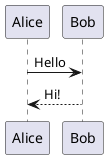
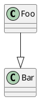

# Markdown Integration

The end goal: write a PlantUML diagram in a Markdown file inside a fenced code
block, and have it rendered automatically — exactly like Mermaid.

```markdown
    ```plantuml
    @startuml
    Alice -> Bob: Hello
    @enduml
    ```
```

The library must support every environment where Markdown is rendered:

| Environment | Integration mechanism |
|-------------|----------------------|
| Browser (static HTML) | `<script>` tag auto-init |
| Markdown-it / Remark | Plugin package |
| Vite / webpack | Bundled import + auto-init |
| VS Code extension | Language renderer |
| GitHub / GitLab | Not directly (they don't run arbitrary JS); use a pre-processor |

---

## Phase 5 — Markdown Integration

This is the final phase. All diagram types do not need to be complete, but
the integration layer must work for every type that is implemented.

### Deliverables

| Deliverable | Description |
|-------------|-------------|
| Auto-init script | `plantuml-js/autoload` — scans DOM on load, replaces code blocks |
| markdown-it plugin | `plantuml-js/markdown-it` — transforms fenced blocks during parse |
| remark plugin | `plantuml-js/remark` — transforms fenced blocks during parse |
| CDN bundle | UMD build that can be loaded with a plain `<script>` tag |
| VS Code snippet | Sample config for integrating with Markdown Preview Enhanced |

---

## Auto-Init (Browser `<script>` Tag)

The simplest integration. Add one script tag to any HTML page that contains
rendered Markdown:

```html
<script type="module">
  import 'https://cdn.example.com/plantuml-js@1.0.0/autoload.js';
</script>
```

`autoload.ts` (the entry point for this bundle):

```typescript
import { render } from './index.js';

async function replaceCodeBlocks(): Promise<void> {
  const blocks = document.querySelectorAll(
    'pre > code.language-plantuml, pre > code.plantuml'
  );
  for (const code of blocks) {
    const source = code.textContent ?? '';
    try {
      const svg = await render(source);
      const wrapper = document.createElement('div');
      wrapper.className = 'plantuml-diagram';
      wrapper.innerHTML = svg;
      code.parentElement!.replaceWith(wrapper);
    } catch (err) {
      const errorDiv = document.createElement('div');
      errorDiv.className = 'plantuml-error';
      errorDiv.textContent = `PlantUML error: ${String(err)}`;
      code.parentElement!.replaceWith(errorDiv);
    }
  }
}

if (document.readyState === 'loading') {
  document.addEventListener('DOMContentLoaded', replaceCodeBlocks);
} else {
  replaceCodeBlocks();
}
```

CSS selector covers both `language-plantuml` (highlight.js convention) and
`plantuml` (bare class name). The wrapper div gets a class so the host page can
style it (center, add a border, etc.).

---

## markdown-it Plugin

For tools that use markdown-it (VitePress, Docusaurus with md-it, custom
static site generators):

```typescript
// src/integrations/markdown-it.ts

import type MarkdownIt from 'markdown-it';
import { renderSync } from '../index.js'; // synchronous render for SSG

export function markdownItPlantuml(md: MarkdownIt): void {
  const defaultFence = md.renderer.rules.fence!;

  md.renderer.rules.fence = (tokens, idx, options, env, self) => {
    const token = tokens[idx];
    if (token.info.trim() !== 'plantuml') {
      return defaultFence(tokens, idx, options, env, self);
    }
    try {
      const svg = renderSync(token.content);
      return `<div class="plantuml-diagram">${svg}</div>\n`;
    } catch (err) {
      return `<div class="plantuml-error">${String(err)}</div>\n`;
    }
  };
}
```

Usage in VitePress:

```typescript
// .vitepress/config.ts
import { markdownItPlantuml } from 'plantuml-js/markdown-it';

export default {
  markdown: {
    config: (md) => md.use(markdownItPlantuml),
  },
};
```

---

## Remark Plugin

For tools that use unified/remark (Astro, Next.js MDX, Gatsby):

```typescript
// src/integrations/remark.ts

import type { Plugin } from 'unified';
import type { Root } from 'mdast';
import { visit } from 'unist-util-visit';
import { renderSync } from '../index.js';

export const remarkPlantuml: Plugin<[], Root> = () => (tree) => {
  visit(tree, 'code', (node, index, parent) => {
    if (node.lang !== 'plantuml') return;
    try {
      const svg = renderSync(node.value);
      parent!.children.splice(index!, 1, {
        type: 'html',
        value: `<div class="plantuml-diagram">${svg}</div>`,
      });
    } catch (err) {
      parent!.children.splice(index!, 1, {
        type: 'html',
        value: `<div class="plantuml-error">${String(err)}</div>`,
      });
    }
  });
};
```

Usage in Astro:

```javascript
// astro.config.mjs
import { remarkPlantuml } from 'plantuml-js/remark';

export default defineConfig({
  markdown: { remarkPlugins: [remarkPlantuml] },
});
```

---

## Synchronous Render (`renderSync`)

The markdown-it and remark plugins need synchronous rendering because their
transform step runs in a synchronous pass (no top-level await). This requires
ELK layout to also run synchronously — which ELK.js supports via
`ELK.layoutSync()`.

```typescript
// src/index.ts (additional export)
export function renderSync(source: string, options?: RenderOptions): string;
```

The only difference from `render()` is that it calls `elk.layoutSync()` instead
of `elk.layout()`. Add this to the architecture and test it alongside `render()`.

### TDD tests for renderSync

**`tests/unit/render-sync.test.ts`**

**it** renderSync returns string (not Promise)  
Input: any valid sequence diagram  
Assert: `typeof renderSync(source) === 'string'` (not a Promise)  
Green when: renderSync calls synchronous layout and returns SVG string directly

**it** renderSync produces identical SVG to render() for sequence diagrams  
Input: sequence diagram (sequence uses built-in layout, always synchronous)  
Assert: `renderSync(source) === await render(source)`  
Green when: both paths call the same sequence layout + renderer

**it** renderSync produces identical SVG to render() for class diagrams  
Input: class diagram (ELK-based)  
Assert: SVGs are structurally equivalent (same nodes and edges, positions may differ slightly)  
Green when: `elk.layoutSync()` used in sync path produces same topology as `elk.layout()`

**it** renderSync throws (not rejects) on invalid syntax  
Input: `"@startuml\nbadline\n@enduml"`  
Assert: `expect(() => renderSync(source)).toThrow()`  
Green when: errors are thrown synchronously rather than triggering promise rejection

---

## Markdown Integration Test Suite

### `tests/integration/markdown.test.ts`

**it** autoload replaces plantuml code blocks in a jsdom document  
```typescript
it('replaces plantuml code blocks', async () => {
  document.body.innerHTML = `
    <pre><code class="language-plantuml">@startuml
Alice -> Bob: hi
@enduml</code></pre>
  `;
  await import('../src/integrations/autoload.js');
  // trigger DOMContentLoaded equivalent
  await replaceCodeBlocks();
  expect(document.querySelector('pre')).toBeNull();
  expect(document.querySelector('.plantuml-diagram svg')).not.toBeNull();
});
```
Green when: autoload removes `<pre>` blocks and inserts SVG wrappers

**it** autoload leaves non-plantuml code blocks untouched  
Assert: `<code class="language-typescript">` block is not replaced  
Green when: selector only matches `language-plantuml` and `plantuml`

**it** autoload renders error div when source is invalid  
Assert: `.plantuml-error` div is present; no `<svg>` in that slot  
Green when: try/catch in autoload creates error div instead of crashing

**it** markdown-it plugin transforms plantuml fence blocks  
```typescript
it('markdown-it plugin renders fence blocks', () => {
  const md = MarkdownIt().use(markdownItPlantuml);
  const result = md.render('```plantuml\n@startuml\nA->B\n@enduml\n```');
  expect(result).toMatch(/class="plantuml-diagram"/);
  expect(result).toMatch(/<svg/);
});
```
Green when: fence rule override is installed and calls renderSync

**it** markdown-it plugin passes non-plantuml fences to default renderer  
Assert: `\`\`\`typescript` block renders as `<pre><code class="language-typescript">`  
Green when: info check causes early return to defaultFence

**it** remark plugin transforms plantuml code nodes  
```typescript
it('remark plugin replaces code node with html node', async () => {
  const file = await unified()
    .use(remarkParse)
    .use(remarkPlantuml)
    .use(remarkHtml)
    .process('```plantuml\n@startuml\nA->B\n@enduml\n```');
  expect(String(file)).toMatch(/class="plantuml-diagram"/);
  expect(String(file)).toMatch(/<svg/);
});
```
Green when: remark plugin visits code nodes and replaces them with html nodes

**it** remark plugin leaves non-plantuml code nodes untouched  
Assert: ` ```typescript ` block is not replaced  
Green when: lang !== 'plantuml' guard in visit callback

---

## Demo App — Markdown Tab

Add a "Markdown" tab to the demo app that shows the integration in action:

```html
<!-- demo/markdown.html -->
<textarea id="md-source">
# Example Document

Here is a sequence diagram:



And a class diagram:


</textarea>
<div id="md-output"></div>
```

The textarea renders via markdown-it + markdownItPlantuml on every keystroke.
This exercises the full Markdown → SVG pipeline in the browser, which is the
exact scenario end users will encounter.

---

## Package Exports (final `package.json` shape)

```json
{
  "name": "plantuml-js",
  "exports": {
    ".":             { "import": "./dist/plantuml-js.js", "require": "./dist/plantuml-js.cjs" },
    "./autoload":    { "import": "./dist/autoload.js" },
    "./markdown-it": { "import": "./dist/markdown-it.js" },
    "./remark":      { "import": "./dist/remark.js" }
  }
}
```

Each integration entry point is a separate small bundle that imports from the
main entry. Tree-shaking ensures only used renderers are bundled.
