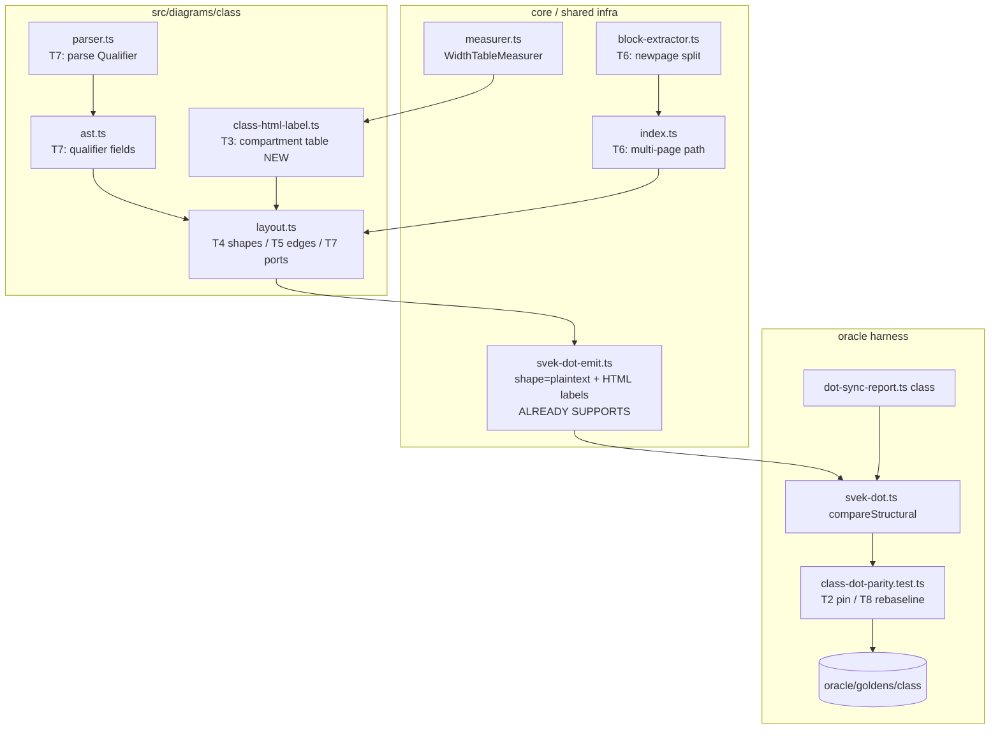

# Component map — Mission A2

```mermaid
graph TD
  subgraph shared[core / shared infra]
    BE[block-extractor.ts<br/>T6: newpage split]
    IDX[index.ts<br/>T6: multi-page path]
    EMIT[svek-dot-emit.ts<br/>shape=plaintext + HTML labels<br/>ALREADY SUPPORTS]
    MEAS[measurer.ts<br/>WidthTableMeasurer]
  end
  subgraph class[src/diagrams/class]
    AST[ast.ts<br/>T7: qualifier fields]
    PARSE[parser.ts<br/>T7: parse Qualifier]
    LAYOUT[layout.ts<br/>T4 shapes / T5 edges / T7 ports]
    HTML[class-html-label.ts<br/>T3: compartment table NEW]
  end
  subgraph harness[oracle harness]
    REPORT[dot-sync-report.ts class]
    CMP[svek-dot.ts compareStructural]
    RATCHET[class-dot-parity.test.ts<br/>T2 pin / T8 rebaseline]
    GOLD[(oracle/goldens/class)]
  end

  PARSE --> AST --> LAYOUT
  HTML --> LAYOUT
  MEAS --> HTML
  LAYOUT --> EMIT
  BE --> IDX --> LAYOUT
  EMIT --> CMP
  REPORT --> CMP --> RATCHET --> GOLD
```
