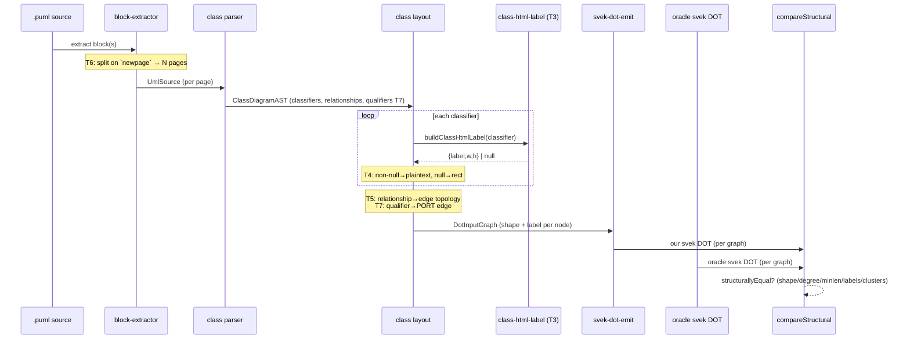

# Data flow — class DOT-sync

```mermaid
sequenceDiagram
  participant Src as .puml source
  participant BE as block-extractor
  participant P as class parser
  participant L as class layout
  participant H as class-html-label (T3)
  participant E as svek-dot-emit
  participant O as oracle svek DOT
  participant C as compareStructural

  Src->>BE: extract block(s)
  Note over BE: T6: split on `newpage` → N pages
  BE->>P: UmlSource (per page)
  P->>L: ClassDiagramAST (classifiers, relationships, qualifiers T7)
  loop each classifier
    L->>H: buildClassHtmlLabel(classifier)
    H-->>L: {label,w,h} | null
    Note over L: T4: non-null→plaintext, null→rect
  end
  Note over L: T5: relationship→edge topology<br/>T7: qualifier→PORT edge
  L->>E: DotInputGraph (shape + label per node)
  E->>C: our svek DOT (per graph)
  O->>C: oracle svek DOT (per graph)
  C-->>C: structurallyEqual? (shape/degree/minlen/labels/clusters)
```
