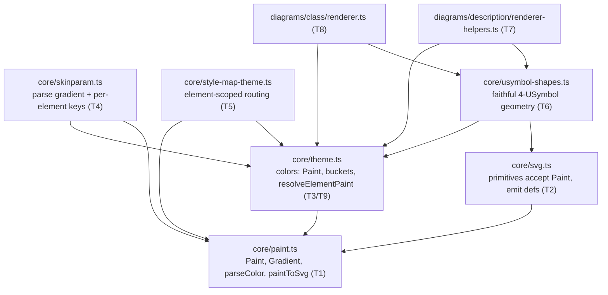
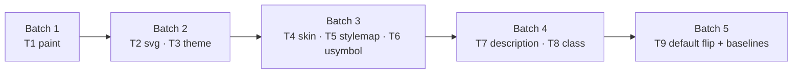

# Component map — module dependencies

Arrows point from consumer to dependency. `paint.ts` is the root; the descriptive
renderers are the leaves. Task ownership in parentheses.

## Batch → module

