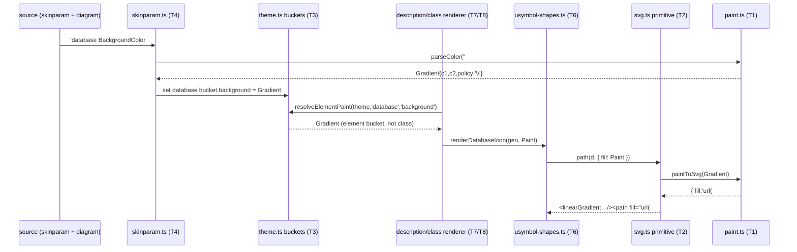
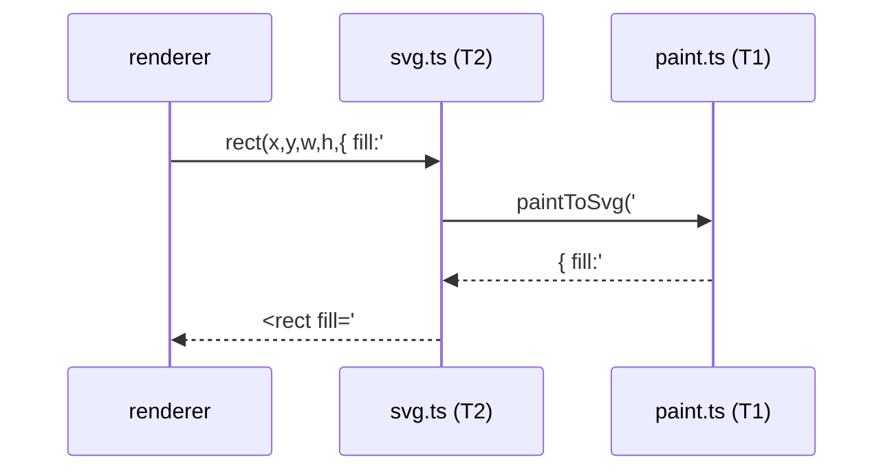

# Data flow — color resolution at render time

How a `skinparam database BackgroundColor #FFd8f4\#FF92d1` reaches a rendered
`fill="url(#…)"` on the cylinder. This is the path the mission builds; the DOT/layout
path is untouched.

## Solid-color path (the common case — unchanged output)

