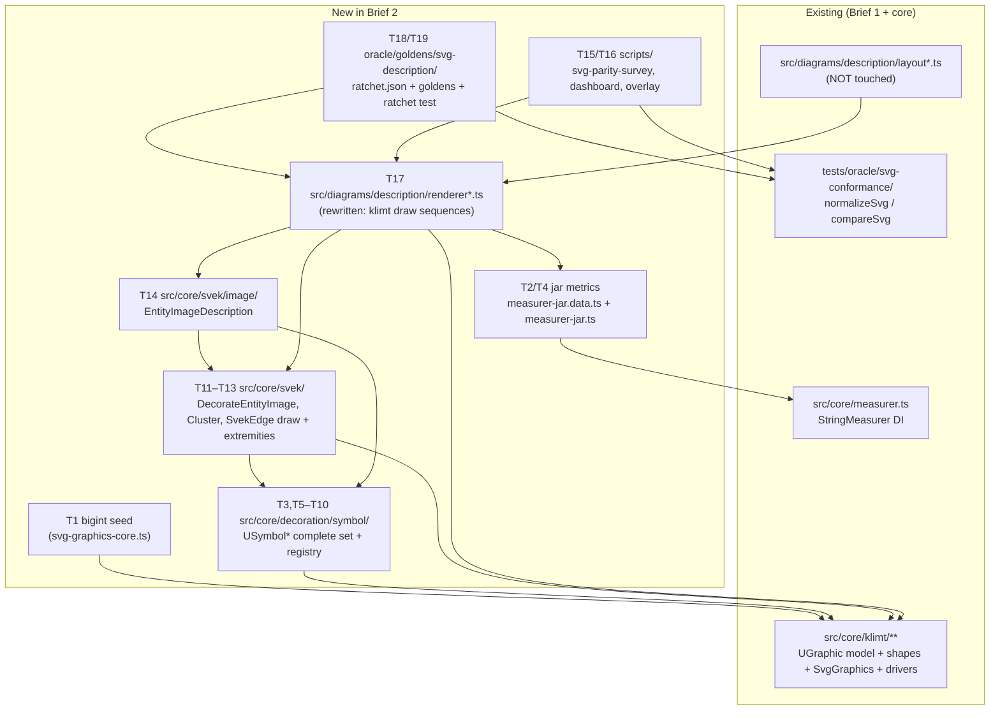

# Component map — Brief 2 module graph

Retired at the end (T20): `tests/visual/{compare.spec.ts,
playwright-visual.config.ts, capture-reference.ts, reference/**}`,
`scripts/visual-qa-svg.ts`, `visual:compare` script.
