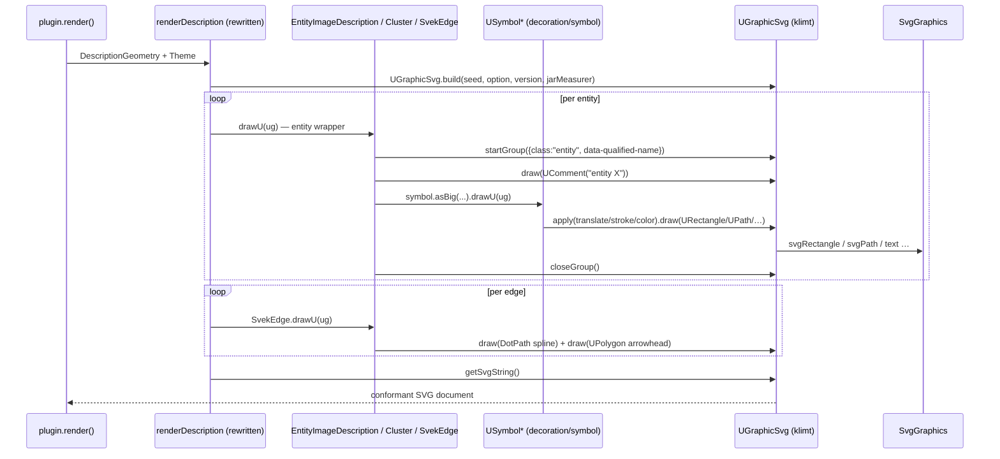
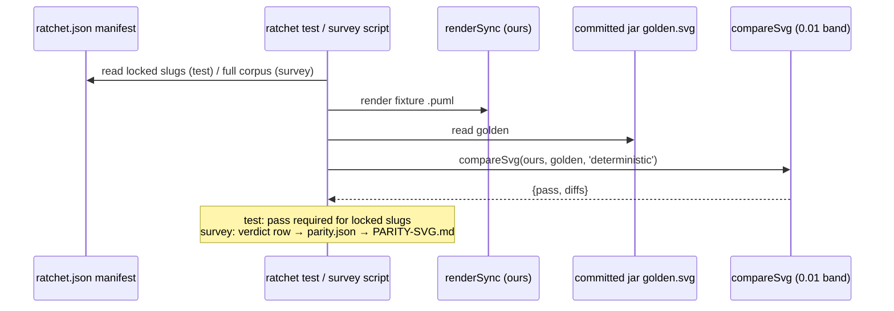

# Data flow — render and conformance paths

## Render path after cutover (T17)

```mermaid
sequenceDiagram
  participant P as plugin.render()
  participant R as renderDescription (rewritten)
  participant E as EntityImageDescription / Cluster / SvekEdge
  participant S as USymbol* (decoration/symbol)
  participant U as UGraphicSvg (klimt)
  participant G as SvgGraphics

  P->>R: DescriptionGeometry + Theme
  R->>U: UGraphicSvg.build(seed, option, version, jarMeasurer)
  loop per entity
    R->>E: drawU(ug) — entity wrapper
    E->>U: startGroup({class:"entity", data-qualified-name})
    E->>U: draw(UComment("entity X"))
    E->>S: symbol.asBig(...).drawU(ug)
    S->>U: apply(translate/stroke/color).draw(URectangle/UPath/…)
    U->>G: svgRectangle / svgPath / text …
    E->>U: closeGroup()
  end
  loop per edge
    R->>E: SvekEdge.drawU(ug)
    E->>U: draw(DotPath spline) + draw(UPolygon arrowhead)
  end
  R->>U: getSvgString()
  U-->>P: conformant SVG document
```

## Conformance paths (T18 ratchet, T15 survey)

```mermaid
sequenceDiagram
  participant M as ratchet.json manifest
  participant T as ratchet test / survey script
  participant RE as renderSync (ours)
  participant J as committed jar golden.svg
  participant H as compareSvg (0.01 band)

  T->>M: read locked slugs (test) / full corpus (survey)
  T->>RE: render fixture .puml
  T->>J: read golden
  T->>H: compareSvg(ours, golden, 'deterministic')
  H-->>T: {pass, diffs}
  Note over T: test: pass required for locked slugs<br/>survey: verdict row → parity.json → PARITY-SVG.md
```
