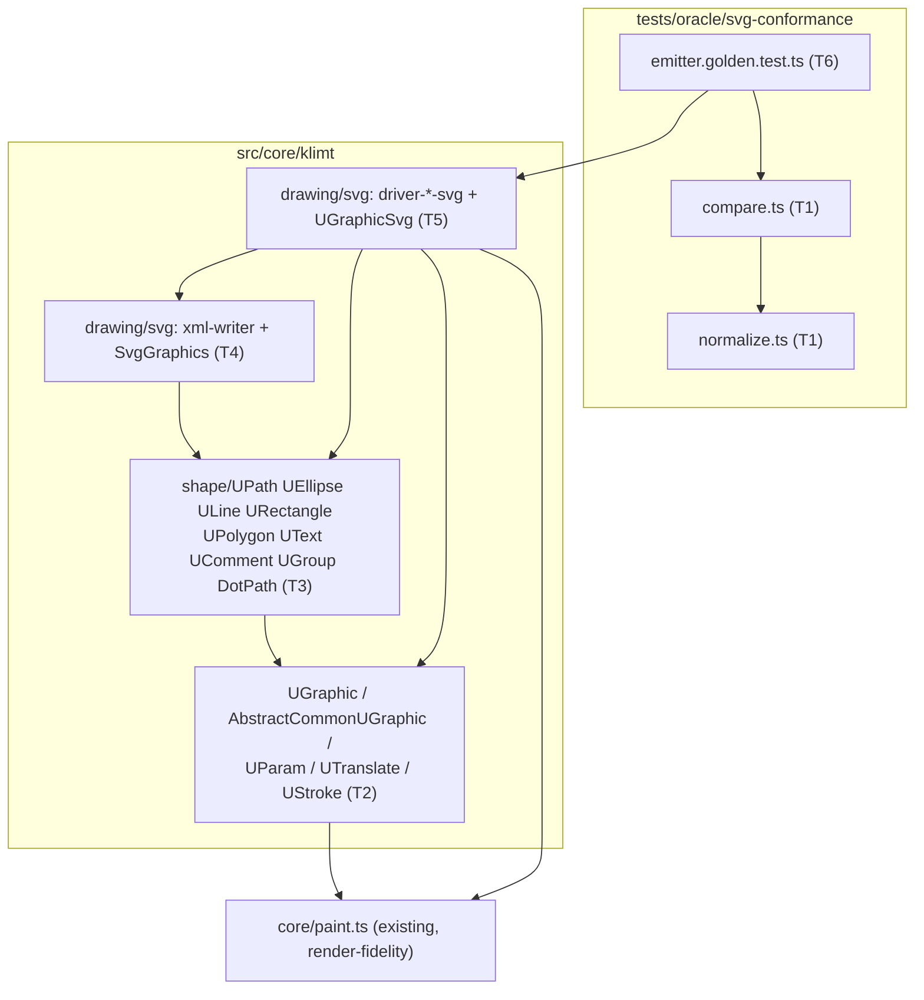
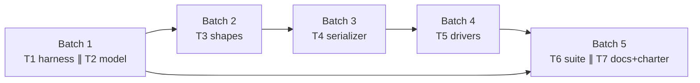
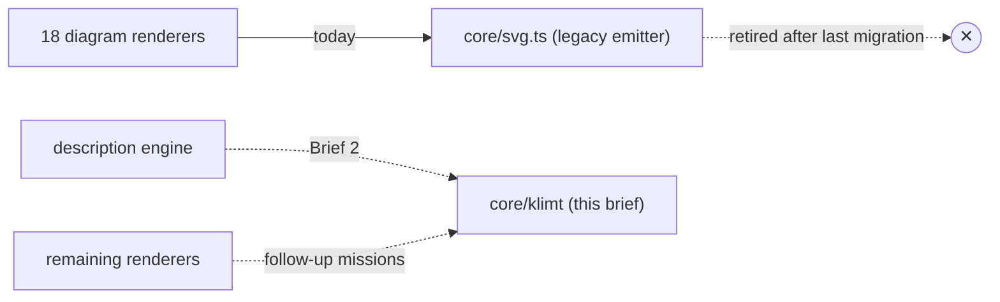

# Component map — module dependencies

Arrows point consumer → dependency. Task ownership in parentheses.
Everything is NEW this brief; no existing module is modified.

## Batch → module

## Coexistence (program view)

