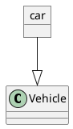

# Object Diagrams — Greenfield Deep Dive (G-7)

This document supplements the mission-guide entry for G-7 (Object Diagram
Greenfield Rebuild). Read it before drafting any agent prompt for this phase.
This phase must be built after G-2 (Class Diagram Greenfield) because it
delegates layout and rendering entirely to the class diagram pipeline.

## Scale of the Java source

| Sub-package | File count | What it contains |
|-------------|-----------|-----------------|
| `objectdiagram/` | 3 | `AbstractClassOrObjectDiagram.java`, `package-info.java`, `readme.md` |
| `objectdiagram/command/` | 6 | All six parser commands (see below) |
| `cucadiagram/` | ~29 shared | `BodierMap.java`, `BodierJSon.java`, `TextBlockMap.java`, `TextBlockCucaJSon.java` are the object-specific additions |
| `svek/image/` | ~48 shared | `EntityImageObject.java`, `EntityImageMap.java`, `EntityImageJson.java` are the key renderers |
| **Total** | **~88** | Mostly shared with class; object-specific new code is modest |

Object diagrams are the thinnest of the greenfield rebuilds. The parser is
the real work. Layout and rendering delegate to the class diagram
implementations without modification.

## Relationship to class diagrams

In the Java source, `AbstractClassOrObjectDiagram` is the common base for
both class and object diagrams. The two diagram types share the `cucadiagram`
entity model, the `svek` layout bridge, and almost all rendering code. The
difference is which entity types the parser produces and which bodier
implementations store their member data.

In the TypeScript port, this relationship is expressed directly: the object
diagram plugin emits a `ClassDiagramAST`, calls `layoutClass`, and calls
`renderClass`. Only the parser (`parseObject`) is object-specific. The
greenfield rebuild preserves this delegation model. The goal of the rebuild
is to make `parseObject` complete — handling map objects, JSON objects,
field=value members, stereotypes, colors, `allowmixing`, and the full
relationship set — not to rewrite the layout or renderer.

The existing `src/diagrams/object/parser.ts` and `src/diagrams/object/index.ts`
are the starting point. They handle the basic `object` declaration and
`field = value` members. The greenfield work extends this.

## Six command files and what they cover

### CommandCreateEntityObject.java

Handles the single-line object declaration:

```
object "Display Name" as alias
object alias
object "Display Name" as alias <<Stereotype>> #color
```

The regex uses `NameAndCodeParser.nameAndCode()` to capture the display name
and code separately. The display name is optional and quoted; the code (alias)
is the unquoted identifier used for references. When no `as alias` is present,
the display name and code are the same value.

The parser also accepts `StereotypePattern.optional("STEREO")`, a URL
(`UrlBuilder.OPTIONAL`), and `ColorParser.exp1()` for the background color.

### CommandCreateEntityObjectMultilines.java

Same regex as `CommandCreateEntityObject` except the line ends with `{`,
opening a body block that is closed by a subsequent `}` line. Members in the
body are parsed by `CommandAddData`.

### CommandAddData.java

Parses member lines inside an open object body:

```
fieldName : value
```

The separator is a **colon**, not `=`. The `DATA` capture group takes
everything after the colon. The field is passed to
`entity.getBodier().addFieldOrMethod(field)`, which stores it as a string in
the bodier. Visibility prefix characters (`+`, `-`, `#`, `~`) at the start
of `DATA` are recognized and the diagram is flagged accordingly.

**This is different from the current TypeScript parser**, which uses `=` as the
separator. The Java source uses `:`. The `=` form is a commonly shown example
in PlantUML documentation and diagrams render correctly with it in the Java
implementation as well — `BodierLikeClassOrObject.addFieldOrMethod` accepts
any string, and the rendered label is the raw string. Both separators appear
in the wild corpus. The parser must accept both.

### CommandCreateMap.java

Handles the map object declaration:

```
map "MapName" as M {
  key1 => value1
  key2 => value2
}
```

The outer declaration regex accepts an optional display name (quoted) plus a
required entity code, optional stereotype, optional URL, optional background
color, and optional line style/color (`##[dotted|dashed|bold]color`). The
body block contains `key => value` lines stored in `BodierMap` as a
`LinkedHashMap<String, String>`, preserving insertion order.

`BodierMap.getLinkedEntry()` also detects arrow-like value syntax (matching
`*-+_?>`) to create directional links from map rows to other entities —
this is the mechanism for the `M::key --> OtherObject` row-reference arrows.

### CommandCreateJson.java

Embeds a JSON tree as an object node inside the diagram:

```
json "Name" {
  "key": "value",
  "nested": { "a": 1 }
}
```

The parser accepts an optional quoted display name plus required code, optional
stereotype, optional URL, optional color, then a multi-line `{ ... }` body
containing raw JSON. The JSON payload is parsed by
`net.sourceforge.plantuml.json.JsonParser` and stored in `BodierJSon`. The
rendered node uses `TextBlockCucaJSon` — a nested tree visually similar to
`@startjson` output but displayed as a diagram node, not a standalone diagram.

### CommandCreateJsonSingleLine.java

Same as `CommandCreateJson` but the entire JSON body fits on one line:

```
json "Name" { "a": 1, "b": 2 }
```

The regex detects the opening `{` and closing `}` on the same line and
extracts the JSON payload inline, without opening a multi-line block.

## Object declaration forms

All of these are valid:

```plantuml
' Quoted display name + alias (most common)
object "Order #42" as o1

' Unquoted alias only (display == alias)
object car

' With stereotype
object "Foo" as f <<InstanceOf>>

' With color
object "Bar" as b #pink

' Single-line body (fields as inline block)
object "Baz" as z { name : Alice }

' Multi-line body
object "Qux" as q {
  name : Alice
  age : 30
}
```

The `as alias` form is the one where the quoted string is the display name and
the unquoted token is the alias. This is **opposite** to some other diagram
types — do not confuse it.

When both unquoted-name and `as alias` appear without quotes, the first token
is treated as display and the second is the alias. When neither is quoted, the
display name and alias are the same value.

## Member syntax: the separator question

Java's `CommandAddData` uses a colon as the separator inside a multi-line
body:

```
fieldName : value
```

The existing TypeScript parser uses `=`:

```
fieldName = value
```

Both appear in real diagrams. The upstream Java implementation stores the raw
string (including the separator and value) as a member display string. The
rendered label is that raw string. To preserve upstream rendering, the parser
must:

1. Accept both `:` and `=` as separators.
2. Store the member's `name` as the field name (left of separator).
3. Store the member's `type` as the value string (right of separator).
4. The renderer joins them as `name : value` or `name = value` depending on
   which separator was found — preserving the original separator in rendered
   output, matching upstream behavior.

A bare word with no separator is also valid and renders as just the field name.

## Map object

### Declaration

```plantuml
map "MapName" as M {
  key1 => value1
  key2 => value2
}
```

The map is a distinct classifier kind from `object`. In the AST, it should be
represented as a classifier with `kind: 'map'`. The `ClassifierKind` union in
`src/diagrams/class/ast.ts` must be extended to include `'map'`. The renderer
must handle `kind === 'map'` by rendering a two-column key-value table instead
of the standard header + member list box.

Layout treats a map node identically to any other classifier — it gets a
bounding box and participates in dot layout. Only the rendering differs.

### Row reference pointers

```plantuml
map "M" as M {
  a => foo
  b => bar
}

M::a --> OtherObject
```

`M::a` is a row-reference: the `::` separates the map's alias from the key
name. An arrow `M::a --> X` attaches to the row for key `a` in map `M`, not
to the map's bounding box as a whole.

This requires the renderer to emit a named anchor per row so that SVG arrows
can terminate at specific row positions. The layout engine assigns positions
to the map node as a whole. The renderer must subdivide the map bounding box
into row segments and emit `id` attributes on the row elements.

The relationship parser must recognise `M::a` as a valid endpoint identifier,
split it into `{ mapId: 'M', rowKey: 'a' }`, and store a row-anchored
relationship in the AST. The renderer resolves the anchor at render time.

`BodierMap.getLinkedEntry()` also detects when a map value itself is an arrow
expression (`*-->` style). This is a map-row-to-entity arrow declared inline
in the map body rather than as a standalone relationship line. The parser must
detect this and emit the equivalent relationship.

## JSON object in object diagram context

```plantuml
json "Config" as C {
  "host": "localhost",
  "port": 8080
}
```

This is not a `@startjson` diagram. It is an object node inside an object
diagram whose body is a JSON tree. The rendered node uses `TextBlockCucaJSon`
— a recursive JSON tree renderer — instead of the flat member list.

In the AST this should be represented as `kind: 'json'`. The `ClassifierKind`
union must be extended to include `'json'`. The classifier carries a `jsonBody`
field holding the parsed JSON value.

The renderer handles `kind === 'json'` by recursively rendering the JSON tree
inside the node box. The rendering is structurally identical to the `@startjson`
renderer but embedded as a diagram node.

Single-line form:

```plantuml
json "Inline" as I { "x": 1 }
```

The parser treats this identically to the multi-line form — the inline `{ ... }`
is extracted as the JSON payload.

## Relationship types

Object diagrams use the same nine relationship types as class diagrams.
The most common in practice are:

| Arrow syntax | Type | Common use |
|-------------|------|-----------|
| `-->` | association | Object holds reference to another |
| `..>` | dependency | Object uses another transiently |
| `..` | usage | Generic dashed line |
| `<|--` / `--|>` | extension | Instance-of or specialisation |

The instantiation relationship (object instance → its class) is modeled as
a dependency arrow with an `<<instanceOf>>` stereotype label, not as a special
arrow type:

```plantuml
object car
class Vehicle

car ..> Vehicle : <<instanceOf>>
```

There is no dedicated instantiation arrow. Do not add one.

Relationship parsing in `parseObject` must handle the `M::a` row-reference
syntax on either endpoint:

```plantuml
M::a --> OtherObject
Source --> M::b
M::a --> N::x
```

The relationship parser currently matches `\w+` for endpoint identifiers. This
must be extended to match `\w+::\w+` as well, and the `Relationship` type
must be extended with optional `fromRow` and `toRow` fields to carry the key
name portion.

## `allowmixing`

When `allowmixing` appears in an object diagram, `class Foo` declarations are
valid alongside `object bar`. The parser must recognise and emit classifiers
with `kind: 'class'` for any class declarations that appear. Without
`allowmixing`, class declarations inside an object diagram are silently
ignored.



The `allowmixing` directive is a flag, not a block. Any `class`, `abstract`,
`interface`, or `enum` declaration encountered after `allowmixing` is accepted
and emits the corresponding classifier kind.

## AST extensions required

The existing `ClassDiagramAST` in `src/diagrams/class/ast.ts` needs two
additions to support object diagrams fully:

### `ClassifierKind` extension

```typescript
export type ClassifierKind =
  | 'class'
  | 'abstract'
  | 'interface'
  | 'enum'
  | 'annotation'
  | 'object'
  | 'map'      // ← new: key => value table node
  | 'json';    // ← new: JSON tree node
```

### `Classifier` extension

```typescript
export interface Classifier {
  // ... existing fields ...
  /** Map entries, in insertion order. Only present when kind === 'map'. */
  mapEntries?: Array<{ key: string; value: string }>;
  /** Parsed JSON body. Only present when kind === 'json'. */
  jsonBody?: unknown;
}
```

### `Relationship` extension

```typescript
export interface Relationship {
  // ... existing fields ...
  /** Row key if the 'from' endpoint is a map row reference (M::key). */
  fromRow?: string;
  /** Row key if the 'to' endpoint is a map row reference (M::key). */
  toRow?: string;
}
```

These additions are additive and backward-compatible with the class diagram.

## Files to create or modify

```
src/diagrams/class/ast.ts                  ← extend ClassifierKind, Classifier, Relationship
src/diagrams/object/
  parser.ts                                ← extend (map, json, allowmixing, row refs, both separators)
  index.ts                                 ← update accepts() to handle 'map' and 'json' keywords
src/diagrams/class/renderer.ts             ← add map and json classifier rendering
tests/unit/object/
  parser.test.ts                           ← extend existing tests; add map/json/row-ref cases
tests/unit/class/
  renderer.test.ts                         ← add tests for map and json node rendering
```

The `index.ts` plugin is largely unchanged. It still delegates to `layoutClass`
and `renderClass`. The `accepts()` predicate needs expanding to catch
`map "..."` and `json "..."` as evidence of an object diagram.

## Watch-outs

**Display name vs alias polarity.** `object "Display Name" as alias` — quoted
string is display, unquoted token is alias. This is opposite to class diagram
convention where `class Alias "Display Name"` puts the alias first. Get it
right before touching anything else.

**Member separator.** Java's `CommandAddData` uses `:`. The existing TypeScript
parser uses `=`. Both appear in real diagrams. Accept both; preserve the
separator in the rendered label.

**Map row references.** `M::key` is a valid relationship endpoint. The `::` is
not a namespace separator here — it is a row selector inside a map. The
namespace separator (`::`) in class diagrams refers to nested namespaces; the
map row reference reuses the same punctuation for a completely different
purpose. These are distinguished by whether the left token is a known map
identifier.

**Inline map row arrows.** A map value that looks like an arrow (`*-->`) is
itself a relationship declaration embedded in the map body. `BodierMap.getLinkedEntry()`
detects this pattern (regex `\\*-+_?\\>`). When present, the parser must emit
a `Relationship` with the map row as the `from` endpoint.

**JSON objects are nodes, not diagrams.** `json "Name" { ... }` inside
`@startuml` ... `@enduml` produces a node in the object diagram. It does not
trigger the JSON diagram renderer. The `@startjson` diagram type remains
independent.

**`allowmixing` scope.** The flag applies to the entire diagram once declared.
It does not need to appear before the class declarations it enables — but in
practice it always appears first. Parse it as a diagram-level flag; set a
boolean in the parse loop and check it when class keywords are encountered.

**Field visibility prefix in `CommandAddData`.** The Java `CommandAddData` marks
the diagram as having visibility modifiers when the data string starts with
`+`, `-`, `#`, or `~`. This affects rendering — when visibility is present,
the circle badge convention for members activates. Track this flag in the AST
and thread it through to the renderer.

**Color and line style on map objects.** The map declaration accepts both a
fill color and a line style/color via `##[dotted|dashed|bold]lineColor`. The
line style is the border style of the map node box. Store both on the
`Classifier` and render them. The existing `Classifier.color` field covers
fill; add `borderColor?: string` and `borderStyle?: 'dotted' | 'dashed' | 'bold'`
to the AST.

## Suggested batch structure

**Batch 1 — AST extensions + parser**

Extend `ClassifierKind` with `'map'` and `'json'`. Extend `Classifier` with
`mapEntries` and `jsonBody`. Extend `Relationship` with `fromRow` and `toRow`.
Add `borderColor` and `borderStyle` to `Classifier`.

Extend `parseObject` to handle:
- Both `:` and `=` member separators
- Map object declarations and `key => value` body lines
- Inline map-row arrows in the map body
- JSON object declarations (multi-line and single-line)
- Row-reference endpoints in relationships (`M::key`)
- `allowmixing` with subsequent class/interface/enum declarations

Update `accepts()` in `index.ts` to recognise `map "..."` and `json "..."`
lines.

Write `tests/unit/object/parser.test.ts` covering all of the above.

**Batch 2 — Map and JSON rendering + row-level connection points**

Extend `renderClass` to handle `kind === 'map'`:
- Two-column table layout (key column, value column)
- Named row anchors (`id` attributes) for row-reference arrow attachment
- Border style (dotted/dashed/bold) when `borderStyle` is set

Extend `renderClass` to handle `kind === 'json'`:
- Recursive JSON tree rendering inside the node box
- Reuse the JSON rendering logic from the existing `@startjson` renderer
  (`src/diagrams/json/renderer.ts`) — do not reimplement it

Update the edge rendering in `renderClass` to resolve `fromRow` / `toRow`
references to the named row anchors emitted by the map renderer.

Write `tests/unit/class/renderer.test.ts` additions for map and JSON node
rendering.

**Quality gates between every batch:**

```sh
npm test && npm run typecheck && npm run lint && npm run build
```

## DOT engine gaps that affect this diagram type

This diagram feeds `DotInputGraph` through the dot layout engine (same pipeline as
class diagrams). Before implementing Batch 2 (layout) and Batch 4 (edge rendering),
read **`planning/dot-layout-deepdive.md`** in full.

The most relevant gaps for object diagrams:
- **Gaps R-1/R-2** (`rank.ts:1317–1319`): Plain and label virtual nodes have wrong
  widths — link labels between objects (association names, role labels) on long
  spanning edges can overlap adjacent object boxes.
- **Gap P-2** (`position.ts:237–249`): `centerVirtualNodes` overwrites label node x —
  association labels drift when edges span more than one rank.
- **Gap S-1** (`splines.ts`): `tailportY` is ignored — `fromRow`/`toRow` anchors
  on attribute rows need port-based routing to exit the object box at the correct
  y-offset for the referenced row, not the center of the box.
- **Gap S-2** (`splines.ts`): Edges route around their own label node.

The `fromRow`/`toRow` port routing gap (S-1) is the most impactful here because
object diagrams often draw edges from specific attribute fields, which requires
the tail port to exit at the field's y position within the object box. This
cannot be correct until `tailportY` is applied in `splines.ts`.

Apply **Fix Batches A–B** from `dot-layout-deepdive.md` before Batch 4 of this
mission. Fix S-1 (tailportY routing) is the most important for object diagrams
specifically and should be included in the same fix batch.
