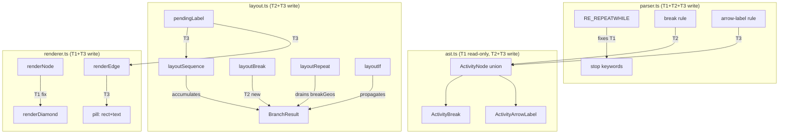

# Component Map — repeat/break/arrow-label

```mermaid
graph TD
  subgraph AST["ast.ts (T1 read-only, T2+T3 write)"]
    AN[ActivityNode union]
    AB[ActivityBreak]
    AAL[ActivityArrowLabel]
  end

  subgraph Parser["parser.ts (T1+T2+T3 write)"]
    RE_RW[RE_REPEATWHILE]
    SK[stop keywords]
    BR[break rule]
    ALR[arrow-label rule]
  end

  subgraph Layout["layout.ts (T2+T3 write)"]
    BR_INT[BranchResult]
    LS[layoutSequence]
    LB[layoutBreak]
    LR[layoutRepeat]
    LI[layoutIf]
    PL[pendingLabel]
  end

  subgraph Renderer["renderer.ts (T1+T3 write)"]
    RN[renderNode]
    RD[renderDiamond]
    RE[renderEdge]
    PILL[pill: rect+text]
  end

  AN --> AB
  AN --> AAL

  RE_RW -->|fixes T1| SK
  BR -->|T2| AN
  ALR -->|T3| AN

  LB -->|T2 new| BR_INT
  LS -->|accumulates| BR_INT
  LI -->|propagates| BR_INT
  LR -->|drains breakGeos| BR_INT

  PL -->|T3| LS
  PL -->|T3| RE

  RN -->|T1 fix| RD
  RE -->|T3| PILL
```
