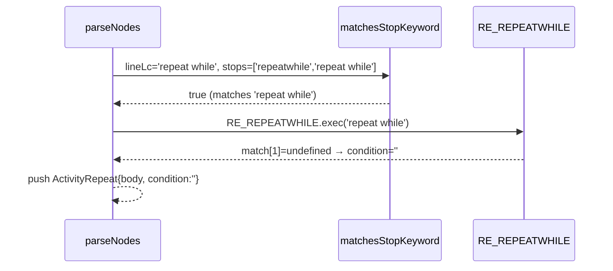
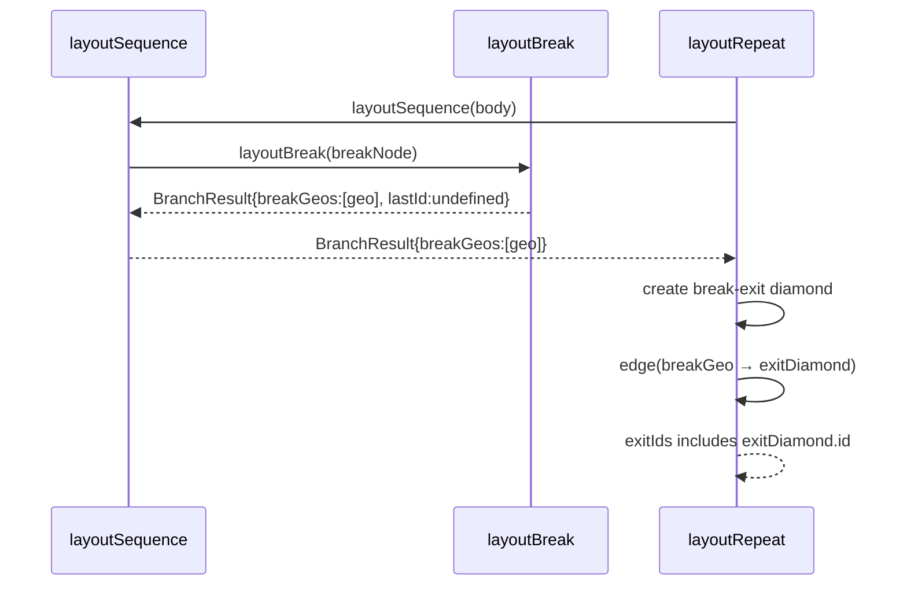
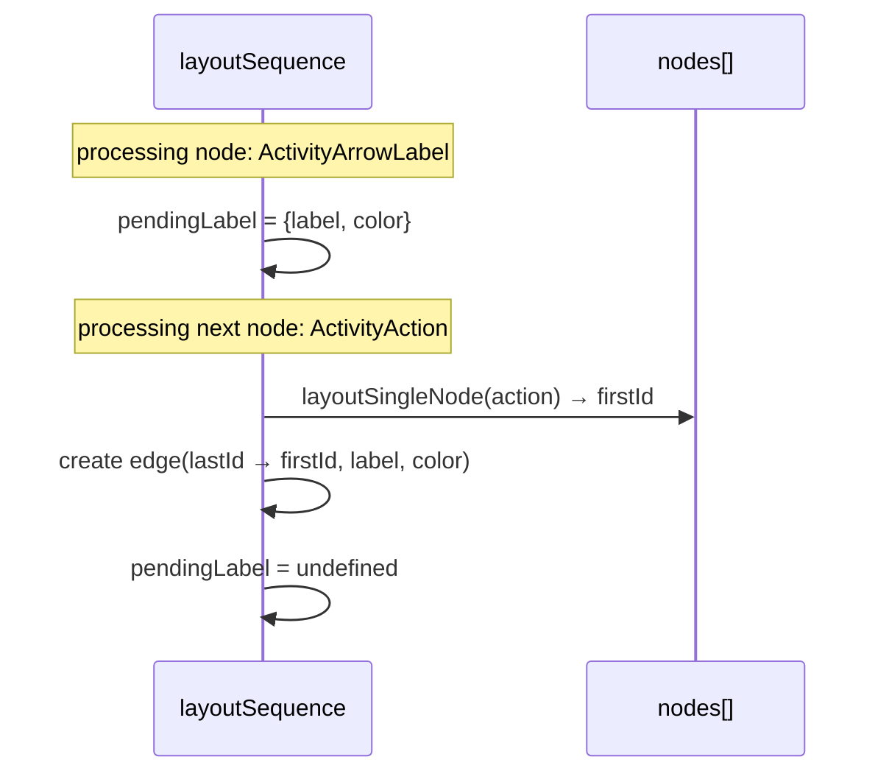

# Data Flow — repeat/break/arrow-label

## T1: repeat terminator fix

```mermaid
sequenceDiagram
  participant P as parseNodes
  participant M as matchesStopKeyword
  participant R as RE_REPEATWHILE

  P->>M: lineLc='repeat while', stops=['repeatwhile','repeat while']
  M-->>P: true (matches 'repeat while')
  P->>R: RE_REPEATWHILE.exec('repeat while')
  R-->>P: match[1]=undefined → condition=''
  P-->>P: push ActivityRepeat{body, condition:''}
```

## T2: break propagation

```mermaid
sequenceDiagram
  participant LS as layoutSequence
  participant LB as layoutBreak
  participant LR as layoutRepeat

  LR->>LS: layoutSequence(body)
  LS->>LB: layoutBreak(breakNode)
  LB-->>LS: BranchResult{breakGeos:[geo], lastId:undefined}
  LS-->>LR: BranchResult{breakGeos:[geo]}
  LR->>LR: create break-exit diamond
  LR->>LR: edge(breakGeo → exitDiamond)
  LR-->>LR: exitIds includes exitDiamond.id
```

## T3: arrow-label pending state

```mermaid
sequenceDiagram
  participant LS as layoutSequence
  participant N as nodes[]

  Note over LS: processing node: ActivityArrowLabel
  LS->>LS: pendingLabel = {label, color}
  Note over LS: processing next node: ActivityAction
  LS->>N: layoutSingleNode(action) → firstId
  LS->>LS: create edge(lastId → firstId, label, color)
  LS->>LS: pendingLabel = undefined
```
