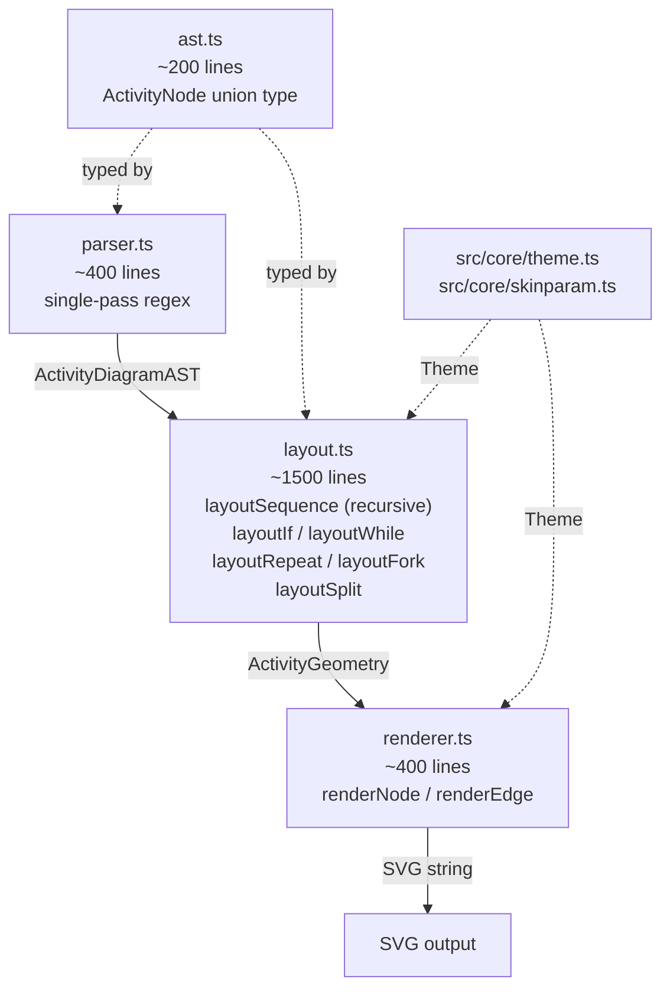
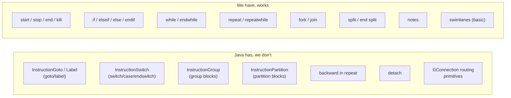

# Component Map

## Java Activity Diagram v3 Architecture

```mermaid
graph TD
    CMD["command/ (46 files)\nCommandActivity*"] -->|creates| INST
    INST["Instruction hierarchy\nInstructionList (root)\nInstructionIf\nInstructionWhile\nInstructionRepeat\nInstructionFork / Split\nInstructionSwitch\nInstructionGroup / Partition\nInstructionBreak / Goto / Label\nInstructionSimple / Start / Stop"]
    INST -->|createGtile()| GTILE
    GTILE["gtile/ (38 files)\nGtile (base)\nGtileTopDown / TopDown3\nGtileIf / IfAlone\nGtileWhile\nGtileRepeat\nGtileFork / Split\nGtileGroup / Partition\nGtileSwitch"]
    GTILE -->|GConnection*| CONN["Connection routing\nGConnectionVerticalDown\nGConnectionVerticalDownThenBack\nGConnectionSideThenVerticalThenSide\nGConnectionHorizontal\n..."]
    GTILE -->|paint()| UG["UGraphic layer\n(SVG/PNG output)"]
    SWIM["Swimlane model\nSwimlane\nMonoSwimable"] -.->|associated with| INST
    SWIM -.->|constrains x-position| GTILE
    SKIN["Style/Skinparam\nSkinParam\nStyleSignatureBasic"] -.->|colors/fonts| GTILE
```

## Our Current TypeScript Architecture



## Gap at a Glance


