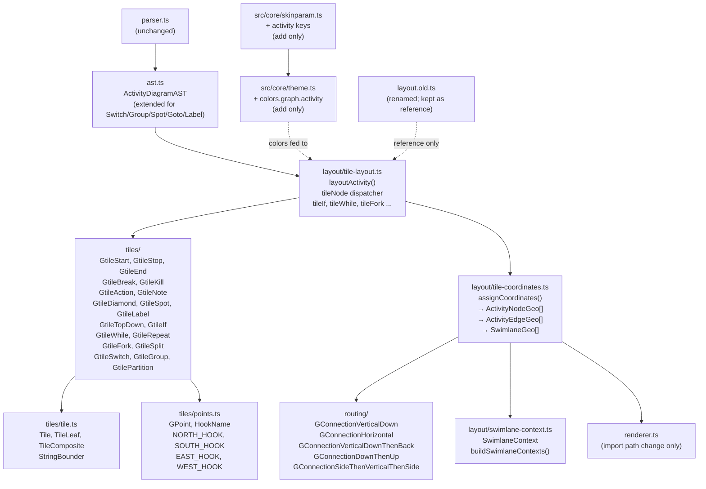

# Component Map — After Tile Rewrite

## Key Invariants

- `tiles/` files carry no canvas-absolute coordinates — tile-relative only
- `tile-coordinates.ts` is the only file that converts tile-relative → canvas-absolute
- `renderer.ts` is unchanged except for a single import path update (T14)
- `layout.old.ts` is never imported after T14 lands
