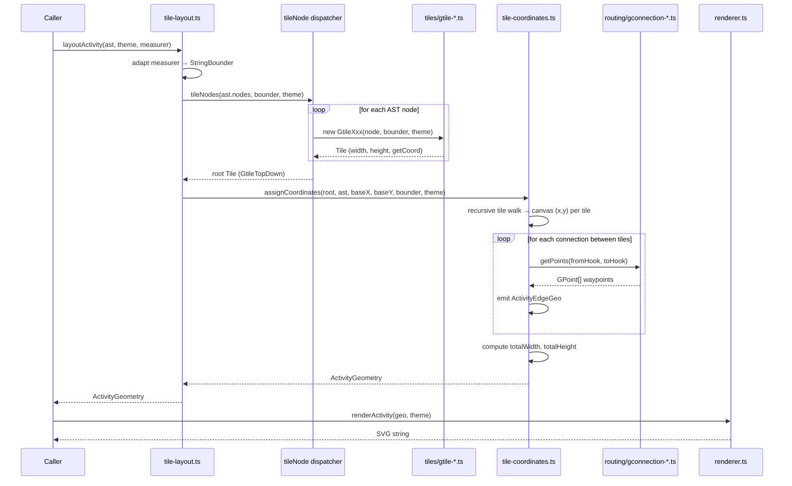
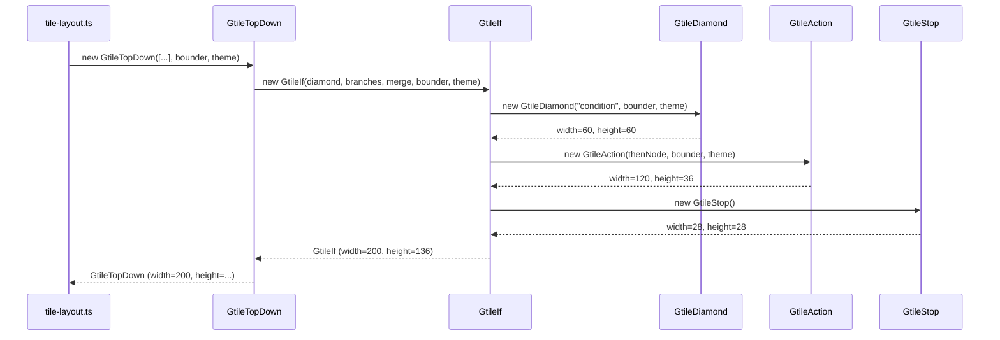
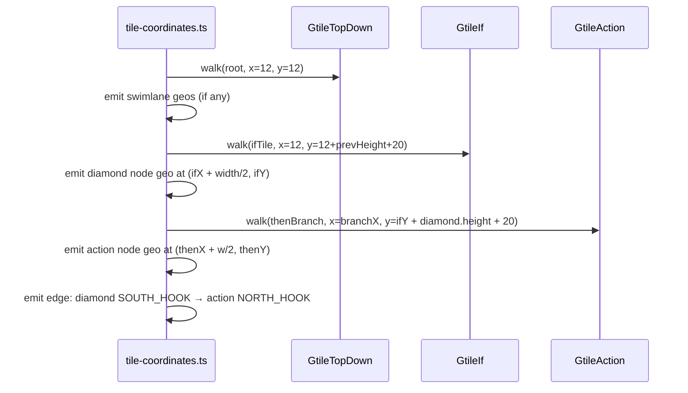

# Data Flow — Tile Layout Pipeline

## Full pipeline sequence

```mermaid
sequenceDiagram
    participant Caller
    participant tile-layout as tile-layout.ts
    participant tileNode as tileNode dispatcher
    participant Tiles as tiles/gtile-*.ts
    participant coords as tile-coordinates.ts
    participant GConn as routing/gconnection-*.ts
    participant renderer as renderer.ts

    Caller->>tile-layout: layoutActivity(ast, theme, measurer)
    tile-layout->>tile-layout: adapt measurer → StringBounder
    tile-layout->>tileNode: tileNodes(ast.nodes, bounder, theme)
    loop for each AST node
        tileNode->>Tiles: new GtileXxx(node, bounder, theme)
        Tiles-->>tileNode: Tile (width, height, getCoord)
    end
    tileNode-->>tile-layout: root Tile (GtileTopDown)
    tile-layout->>coords: assignCoordinates(root, ast, baseX, baseY, bounder, theme)
    coords->>coords: recursive tile walk → canvas (x,y) per tile
    loop for each connection between tiles
        coords->>GConn: getPoints(fromHook, toHook)
        GConn-->>coords: GPoint[] waypoints
        coords->>coords: emit ActivityEdgeGeo
    end
    coords->>coords: compute totalWidth, totalHeight
    coords-->>tile-layout: ActivityGeometry
    tile-layout-->>Caller: ActivityGeometry
    Caller->>renderer: renderActivity(geo, theme)
    renderer-->>Caller: SVG string
```

## Tile construction (Phase: build tile tree)

```mermaid
sequenceDiagram
    participant TL as tile-layout.ts
    participant TD as GtileTopDown
    participant IF as GtileIf
    participant DIA as GtileDiamond
    participant ACT as GtileAction
    participant STOP as GtileStop

    TL->>TD: new GtileTopDown([...], bounder, theme)
    TD->>IF: new GtileIf(diamond, branches, merge, bounder, theme)
    IF->>DIA: new GtileDiamond("condition", bounder, theme)
    DIA-->>IF: width=60, height=60
    IF->>ACT: new GtileAction(thenNode, bounder, theme)
    ACT-->>IF: width=120, height=36
    IF->>STOP: new GtileStop()
    STOP-->>IF: width=28, height=28
    IF-->>TD: GtileIf (width=200, height=136)
    TD-->>TL: GtileTopDown (width=200, height=...)
```

## Coordinate assignment (Phase: canvas coords)

```mermaid
sequenceDiagram
    participant CA as tile-coordinates.ts
    participant TD as GtileTopDown
    participant IF as GtileIf
    participant ACT as GtileAction

    CA->>TD: walk(root, x=12, y=12)
    CA->>CA: emit swimlane geos (if any)
    CA->>IF: walk(ifTile, x=12, y=12+prevHeight+20)
    CA->>CA: emit diamond node geo at (ifX + width/2, ifY)
    CA->>ACT: walk(thenBranch, x=branchX, y=ifY + diamond.height + 20)
    CA->>CA: emit action node geo at (thenX + w/2, thenY)
    CA->>CA: emit edge: diamond SOUTH_HOOK → action NORTH_HOOK
```
