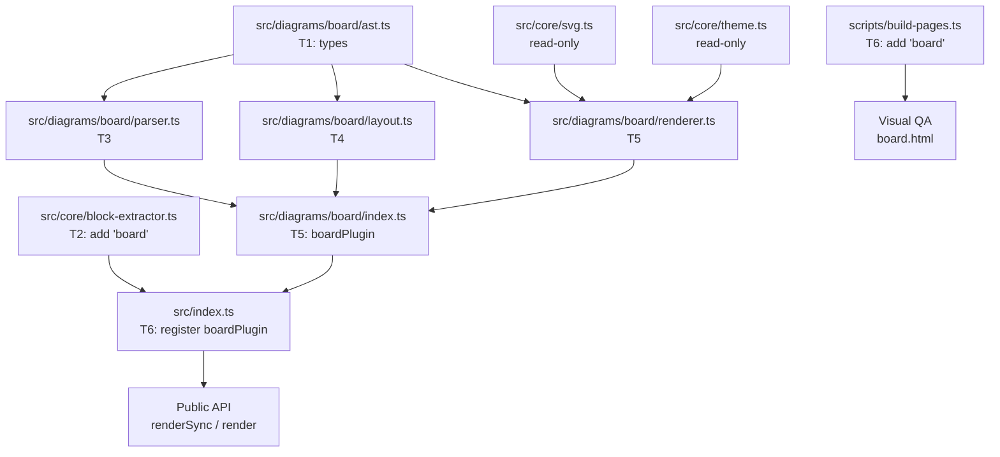
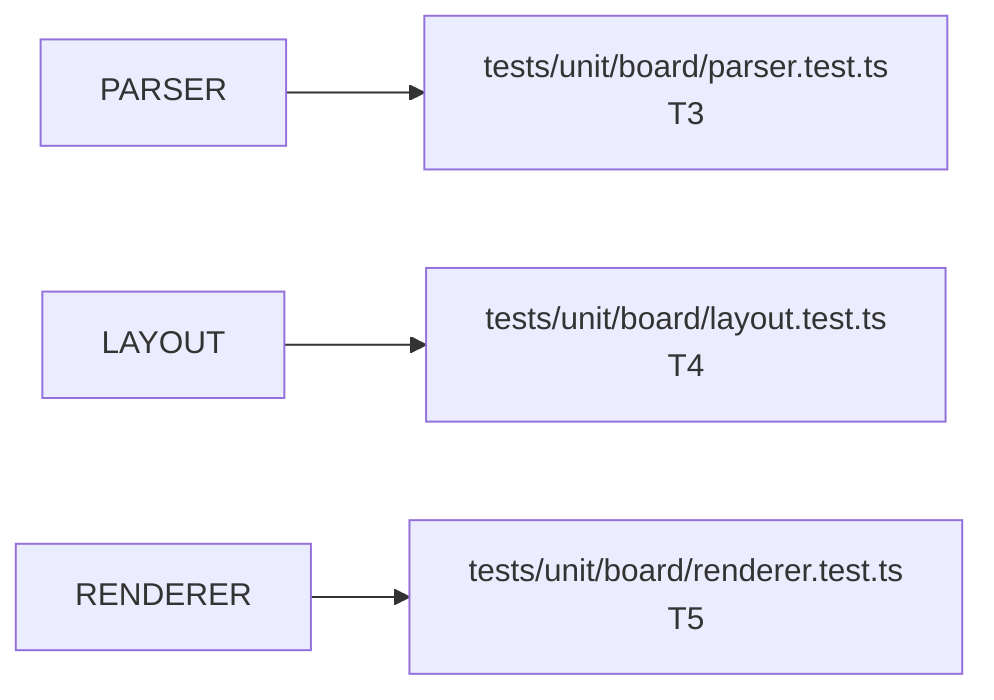

# Component Map

```mermaid
graph TD
    BE[src/core/block-extractor.ts<br/>T2: add 'board'] --> IDX[src/index.ts<br/>T6: register boardPlugin]
    AST[src/diagrams/board/ast.ts<br/>T1: types] --> PARSER[src/diagrams/board/parser.ts<br/>T3]
    AST --> LAYOUT[src/diagrams/board/layout.ts<br/>T4]
    AST --> RENDERER[src/diagrams/board/renderer.ts<br/>T5]
    PARSER --> PLUGIN[src/diagrams/board/index.ts<br/>T5: boardPlugin]
    LAYOUT --> PLUGIN
    RENDERER --> PLUGIN
    PLUGIN --> IDX
    SVG[src/core/svg.ts<br/>read-only] --> RENDERER
    THEME[src/core/theme.ts<br/>read-only] --> RENDERER
    IDX --> API[Public API<br/>renderSync / render]
    PAGES[scripts/build-pages.ts<br/>T6: add 'board'] --> VQA[Visual QA<br/>board.html]
```

## Test coverage

```mermaid
graph LR
    PARSER --> PT[tests/unit/board/parser.test.ts<br/>T3]
    LAYOUT --> LT[tests/unit/board/layout.test.ts<br/>T4]
    RENDERER --> RT[tests/unit/board/renderer.test.ts<br/>T5]
```
