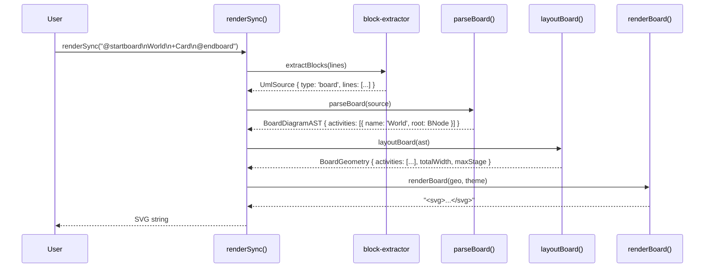
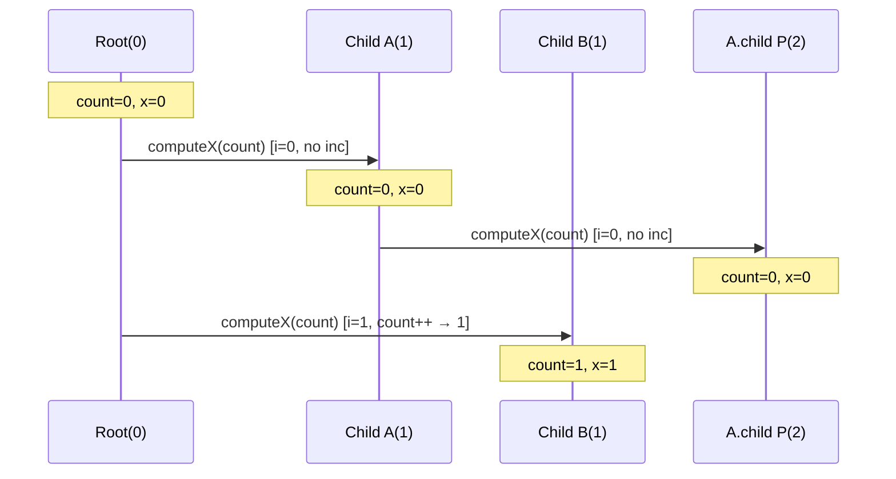

# Data Flow

```mermaid
sequenceDiagram
    participant User
    participant API as renderSync()
    participant BE as block-extractor
    participant Parser as parseBoard()
    participant Layout as layoutBoard()
    participant Renderer as renderBoard()

    User->>API: renderSync("@startboard\nWorld\n+Card\n@endboard")
    API->>BE: extractBlocks(lines)
    BE-->>API: UmlSource { type: 'board', lines: [...] }
    API->>Parser: parseBoard(source)
    Parser-->>API: BoardDiagramAST { activities: [{ name: 'World', root: BNode }] }
    API->>Layout: layoutBoard(ast)
    Layout-->>API: BoardGeometry { activities: [...], totalWidth, maxStage }
    API->>Renderer: renderBoard(geo, theme)
    Renderer-->>API: "<svg>...</svg>"
    API-->>User: SVG string
```

## computeX DFS Detail

```mermaid
sequenceDiagram
    participant Root as Root(0)
    participant A as Child A(1)
    participant B as Child B(1)
    participant P as A.child P(2)

    Note over Root: count=0, x=0
    Root->>A: computeX(count) [i=0, no inc]
    Note over A: count=0, x=0
    A->>P: computeX(count) [i=0, no inc]
    Note over P: count=0, x=0
    Root->>B: computeX(count) [i=1, count++ → 1]
    Note over B: count=1, x=1
```
