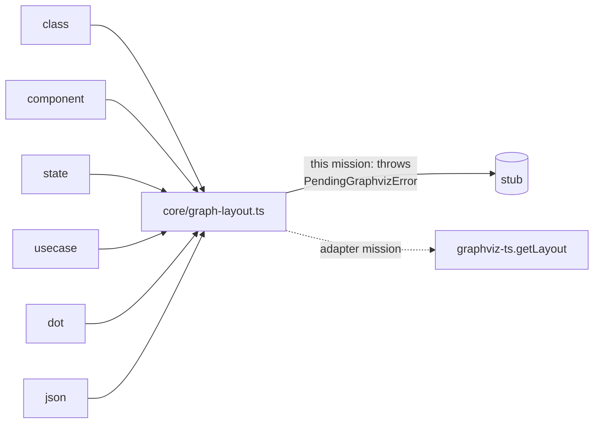

# Mission: burn-graphviz-engines

Demolish-first step of the graphviz-ts re-founding. Delete plantuml-ts's
in-house graphviz layout engines (~38 files, ~9.7k LOC) — wholly superseded by
the `graphviz-ts` package — and funnel the 7 scattered seam consumers through a
single chokepoint that today throws and tomorrow becomes the graphviz-ts adapter.

End state: the tree **compiles and all gates pass**; the 6 graph diagram types
(`class, component, state, usecase, dot, json`) intentionally **throw at render**
until the follow-on adapter mission wires `graphviz-ts`.

## Branch
`refactor/burn-graphviz-engines` off the current branch. Squash on merge.

## Context
- `graphviz-ts` (~/git/graphviz-ts) replaces every `src/core/<engine>` dir.
- Faithful to upstream: PlantUML's Svek generates DOT; graphviz lays out.
- This mission removes the engines and stubs the seam. It does **not** wire
  graphviz-ts (that is the adapter mission, seeded by T6).

## The chokepoint
All graph layout flows through one new module — `src/core/graph-layout.ts`
(`layoutGraph()`), the single seam consumer. See `decisions.md`.

## Constraints
**Stop if:** a file outside the write-set needs changes; 2 consecutive gate
failures; a keeper renderer (sequence, packetdiag, yaml, json *body*, hcl, files,
chronology) would need behavioral changes; deleting an engine breaks a consumer
not in the dark-six.
**Push forward on:** exact deletion order; which engine-internal test files match
the import-based delete rule; lint/format autofixes.

## Quality gates (all must pass to close)
| Command | Expect |
|---|---|
| `npm run typecheck` | exit 0 (stub preserves seam types) |
| `npm run lint` | exit 0 |
| `npm test` | exit 0 (engine tests deleted, dark-type layout/render tests skipped) |
| `npm run build` | exit 0 |

## Batches
| Batch | Status |
|---|---|
| [batch-1](batch-1/overview.md) — burn + stub + tests + handoff (T1–T6, sequential) | [x] |

## Index
- [decisions.md](decisions.md) — D1–D6
- [batch-1/overview.md](batch-1/overview.md) — task table
- [diagrams/component-map.md](diagrams/component-map.md) — before/after
- [decision-journal.md](decision-journal.md) — appended during execution
- Hand-off seed (produced by T6): `handoff-adapter.md`

## Pre-flight notes
- Uncommitted `src/diagrams/dot/renderer.ts` (pre-existing, unrelated) — commit
  or stash before executing; it is **not** in this mission's write-set.
- Baseline typecheck passes **only while `dist/` exists** — the demo resolves
  `plantuml-ts` via the built `dist/plantuml-ts.d.ts`, not a tsc path. T5's
  `npm run build` keeps it green; do not "fix" the demo import or touch the demo.
