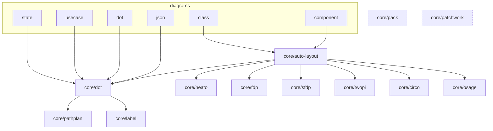
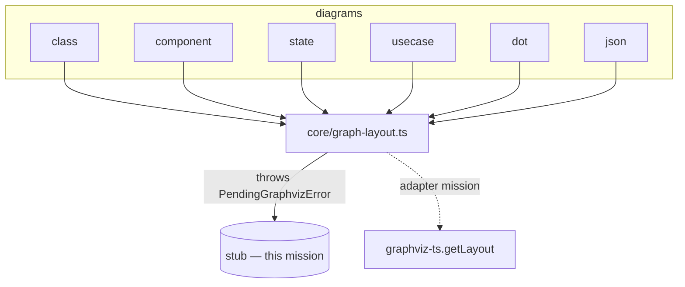

# Component map — before / after

## Before (in-house engines, scattered consumers)

## After (single chokepoint, engines gone)

Deleted: `core/{dot,circo,fdp,neato,osage,pack,patchwork,pathplan,sfdp,twopi,label}`
and `core/auto-layout.ts`. Born: `core/graph-layout.ts` + `core/graph-layout.types.ts`.
