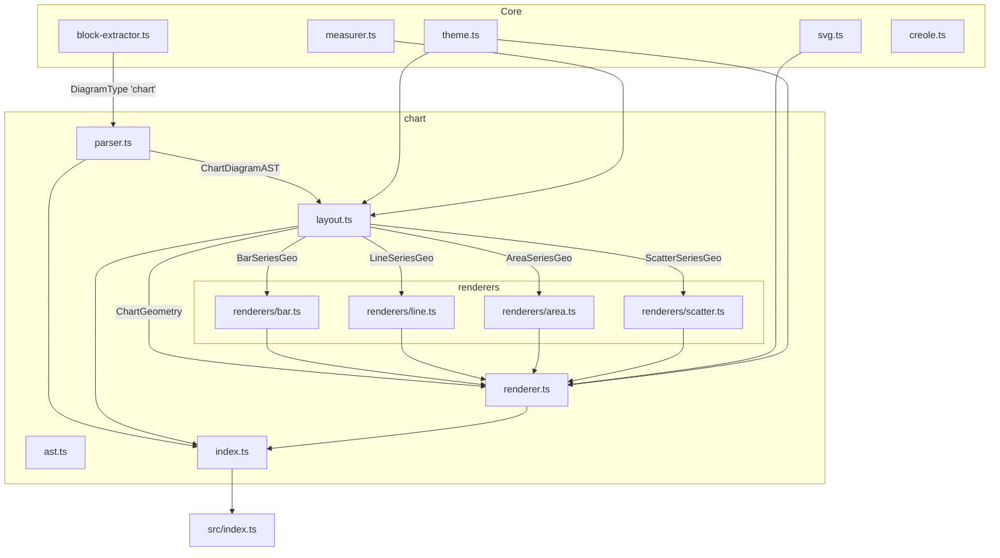

```mermaid
graph TD
  subgraph Core
    BE[block-extractor.ts]
    SVG[svg.ts]
    THEME[theme.ts]
    MEAS[measurer.ts]
    CREOLE[creole.ts]
  end

  subgraph chart
    AST[ast.ts]
    PARSER[parser.ts]
    LAYOUT[layout.ts]
    subgraph renderers
      BAR[renderers/bar.ts]
      LINE[renderers/line.ts]
      AREA[renderers/area.ts]
      SCAT[renderers/scatter.ts]
    end
    RENDER[renderer.ts]
    INDEX[index.ts]
  end

  IDX[src/index.ts]

  BE -->|DiagramType 'chart'| PARSER
  PARSER -->|ChartDiagramAST| LAYOUT
  LAYOUT -->|ChartGeometry| RENDER
  LAYOUT -->|BarSeriesGeo| BAR
  LAYOUT -->|LineSeriesGeo| LINE
  LAYOUT -->|AreaSeriesGeo| AREA
  LAYOUT -->|ScatterSeriesGeo| SCAT
  BAR --> RENDER
  LINE --> RENDER
  AREA --> RENDER
  SCAT --> RENDER
  SVG --> RENDER
  THEME --> LAYOUT
  THEME --> RENDER
  MEAS --> LAYOUT
  INDEX --> IDX
  PARSER --> INDEX
  LAYOUT --> INDEX
  RENDER --> INDEX
```
