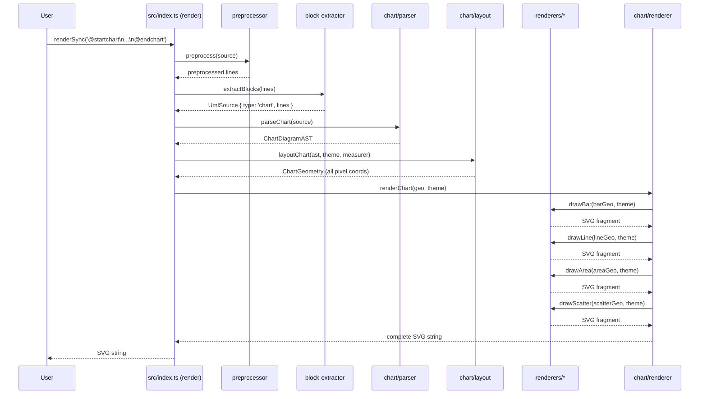

```mermaid
sequenceDiagram
    participant User
    participant API as src/index.ts (render)
    participant Pre as preprocessor
    participant BE as block-extractor
    participant Parser as chart/parser
    participant Layout as chart/layout
    participant Sub as renderers/*
    participant Orch as chart/renderer

    User->>API: renderSync('@startchart\n...\n@endchart')
    API->>Pre: preprocess(source)
    Pre-->>API: preprocessed lines
    API->>BE: extractBlocks(lines)
    BE-->>API: UmlSource { type: 'chart', lines }
    API->>Parser: parseChart(source)
    Parser-->>API: ChartDiagramAST
    API->>Layout: layoutChart(ast, theme, measurer)
    Layout-->>API: ChartGeometry (all pixel coords)
    API->>Orch: renderChart(geo, theme)
    Orch->>Sub: drawBar(barGeo, theme)
    Sub-->>Orch: SVG fragment
    Orch->>Sub: drawLine(lineGeo, theme)
    Sub-->>Orch: SVG fragment
    Orch->>Sub: drawArea(areaGeo, theme)
    Sub-->>Orch: SVG fragment
    Orch->>Sub: drawScatter(scatterGeo, theme)
    Sub-->>Orch: SVG fragment
    Orch-->>API: complete SVG string
    API-->>User: SVG string
```
