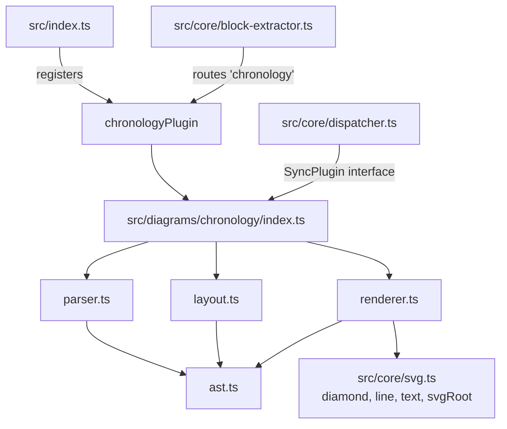

# Component Map



```mermaid
graph LR
    SRC["@startchronology source"] --> P[parseChronology]
    P --> AST[ChronologyDiagramAST\nevents: ChronologyEvent\{\}]
    AST --> L[layoutChronology]
    L --> GEO[ChronologyGeometry\nevents x/labelAbove\ndayTicks x/label\ndimensions]
    GEO --> R[renderChronology]
    R --> SVG["SVG string"]
```
