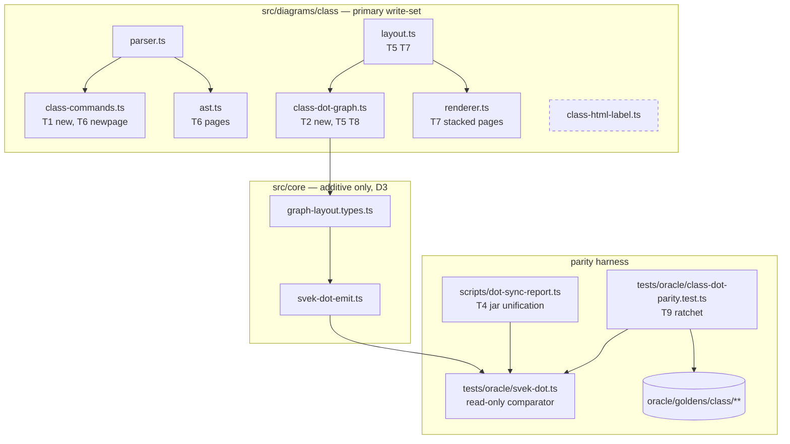

# Component map — what this mission touches

`class-html-label.ts` (dashed) is deleted in T3. The description engine's
files are out of write-set entirely; its ratchet is the shared-file
regression gate.
