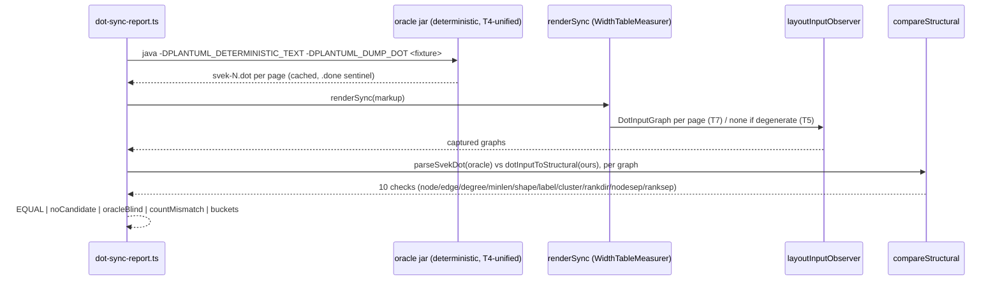

# Parity measurement flow

```mermaid
sequenceDiagram
  participant RPT as dot-sync-report.ts
  participant JAR as oracle jar (deterministic, T4-unified)
  participant TS as renderSync (WidthTableMeasurer)
  participant OBS as layoutInputObserver
  participant CMP as compareStructural

  RPT->>JAR: java -DPLANTUML_DETERMINISTIC_TEXT -DPLANTUML_DUMP_DOT <fixture>
  JAR-->>RPT: svek-N.dot per page (cached, .done sentinel)
  RPT->>TS: renderSync(markup)
  TS->>OBS: DotInputGraph per page (T7) / none if degenerate (T5)
  OBS-->>RPT: captured graphs
  RPT->>CMP: parseSvekDot(oracle) vs dotInputToStructural(ours), per graph
  CMP-->>RPT: 10 checks (node/edge/degree/minlen/shape/label/cluster/rankdir/nodesep/ranksep)
  RPT-->>RPT: EQUAL | noCandidate | oracleBlind | countMismatch | buckets
```

The ratchet (`class-dot-parity.test.ts`) replays the same comparison against
committed goldens inside `npm test` — that's the regression alarm.
