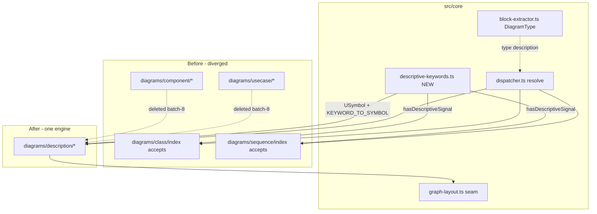

# Component map

Affected components and how they relate before/after the merge.

- `descriptive-keywords.ts` is the single source consumed by both the Phase-1
  guards (`class`, `sequence`) and the Phase-2 engine (`description`).
- `component/*` and `usecase/*` are deleted in Batch 8 once `description/*` is
  proven and registered.
