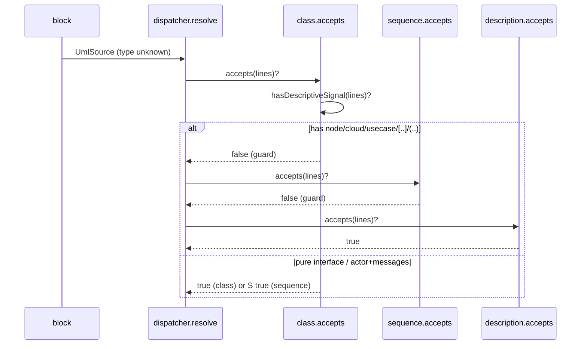
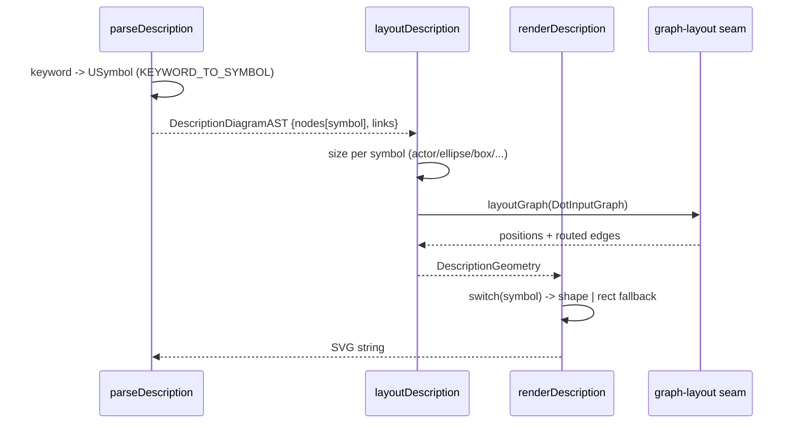

# Data flow

## Dispatch (Phase 1 guard)

```mermaid
sequenceDiagram
  participant B as block
  participant R as dispatcher.resolve
  participant C as class.accepts
  participant S as sequence.accepts
  participant D as description.accepts
  B->>R: UmlSource (type unknown)
  R->>C: accepts(lines)?
  C->>C: hasDescriptiveSignal(lines)?
  alt has node/cloud/usecase/[..]/(..)
    C-->>R: false (guard)
    R->>S: accepts(lines)?
    S-->>R: false (guard)
    R->>D: accepts(lines)?
    D-->>R: true
  else pure interface / actor+messages
    C-->>R: true (class) or S true (sequence)
  end
```

## Engine pipeline (Phase 2)

```mermaid
sequenceDiagram
  participant P as parseDescription
  participant L as layoutDescription
  participant Rn as renderDescription
  participant G as graph-layout seam
  P->>P: keyword -> USymbol (KEYWORD_TO_SYMBOL)
  P-->>L: DescriptionDiagramAST {nodes[symbol], links}
  L->>L: size per symbol (actor/ellipse/box/...)
  L->>G: layoutGraph(DotInputGraph)
  G-->>L: positions + routed edges
  L-->>Rn: DescriptionGeometry
  Rn->>Rn: switch(symbol) -> shape | rect fallback
  Rn-->>P: SVG string
```
