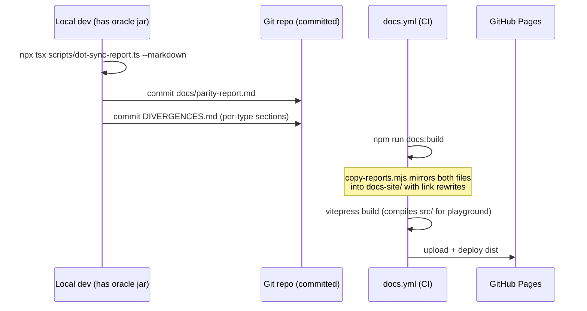
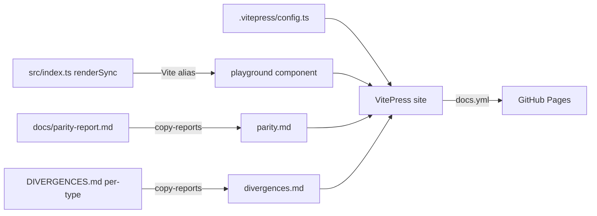

# Report pipeline data flow

```mermaid
sequenceDiagram
    participant Dev as Local dev (has oracle jar)
    participant Repo as Git repo (committed)
    participant CI as docs.yml (CI)
    participant Pages as GitHub Pages

    Dev->>Dev: npx tsx scripts/dot-sync-report.ts --markdown
    Dev->>Repo: commit docs/parity-report.md
    Dev->>Repo: commit DIVERGENCES.md (per-type sections)
    CI->>CI: npm run docs:build
    Note over CI: copy-reports.mjs mirrors both files<br/>into docs-site/ with link rewrites
    CI->>CI: vitepress build (compiles src/ for playground)
    CI->>Pages: upload + deploy dist
```

```mermaid
graph LR
    src[src/index.ts renderSync] -->|Vite alias| PG[playground component]
    PR[docs/parity-report.md] -->|copy-reports| P[parity.md]
    DV[DIVERGENCES.md per-type] -->|copy-reports| D[divergences.md]
    CFG[.vitepress/config.ts] --> Site[VitePress site]
    PG --> Site
    P --> Site
    D --> Site
    Site -->|docs.yml| GH[GitHub Pages]
```
