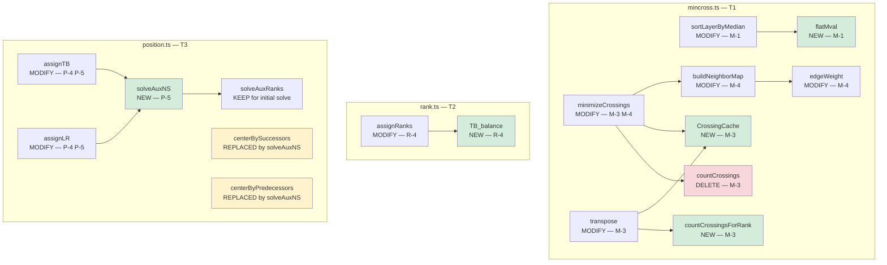

# Component Map — Affected Functions

```mermaid
graph TD
    subgraph mincross.ts [mincross.ts — T1]
        SLM[sortLayerByMedian\nMODIFY — M-1]
        FM[flatMval\nNEW — M-1]
        EW[edgeWeight\nMODIFY — M-4]
        BNM[buildNeighborMap\nMODIFY — M-4]
        CFR[countCrossingsForRank\nNEW — M-3]
        CC[CrossingCache\nNEW — M-3]
        TR[transpose\nMODIFY — M-3]
        MC[minimizeCrossings\nMODIFY — M-3 M-4]
        OLD[countCrossings\nDELETE — M-3]
    end

    subgraph rank.ts [rank.ts — T2]
        TB[TB_balance\nNEW — R-4]
        AR[assignRanks\nMODIFY — R-4]
    end

    subgraph position.ts [position.ts — T3]
        ATB[assignTB\nMODIFY — P-4 P-5]
        ALR[assignLR\nMODIFY — P-4 P-5]
        NS[solveAuxNS\nNEW — P-5]
        SAR[solveAuxRanks\nKEEP for initial solve]
        CBS[centerBySuccessors\nREPLACED by solveAuxNS]
        CBP[centerByPredecessors\nREPLACED by solveAuxNS]
    end

    SLM --> FM
    MC --> BNM
    BNM --> EW
    MC --> CC
    TR --> CC
    TR --> CFR
    MC --> OLD

    AR --> TB

    ATB --> NS
    ALR --> NS
    NS --> SAR

    style FM fill:#d4edda
    style CFR fill:#d4edda
    style CC fill:#d4edda
    style TB fill:#d4edda
    style NS fill:#d4edda
    style OLD fill:#f8d7da
    style CBS fill:#fff3cd
    style CBP fill:#fff3cd
```

Legend: green = new, red = deleted, yellow = superseded by new function.
