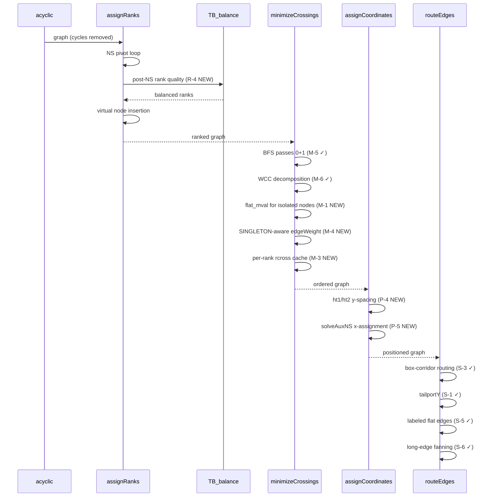

# Data Flow — Dot Layout Pipeline (post-mission)

```mermaid
sequenceDiagram
    participant AC as acyclic
    participant RK as assignRanks
    participant TB as TB_balance
    participant MC as minimizeCrossings
    participant PO as assignCoordinates
    participant SP as routeEdges

    AC->>RK: graph (cycles removed)
    RK->>RK: NS pivot loop
    RK->>TB: post-NS rank quality (R-4 NEW)
    TB-->>RK: balanced ranks
    RK->>RK: virtual node insertion
    RK-->>MC: ranked graph

    MC->>MC: BFS passes 0+1 (M-5 ✓)
    MC->>MC: WCC decomposition (M-6 ✓)
    MC->>MC: flat_mval for isolated nodes (M-1 NEW)
    MC->>MC: SINGLETON-aware edgeWeight (M-4 NEW)
    MC->>MC: per-rank rcross cache (M-3 NEW)
    MC-->>PO: ordered graph

    PO->>PO: ht1/ht2 y-spacing (P-4 NEW)
    PO->>PO: solveAuxNS x-assignment (P-5 NEW)
    PO-->>SP: positioned graph

    SP->>SP: box-corridor routing (S-3 ✓)
    SP->>SP: tailportY (S-1 ✓)
    SP->>SP: labeled flat edges (S-5 ✓)
    SP->>SP: long-edge fanning (S-6 ✓)
```
