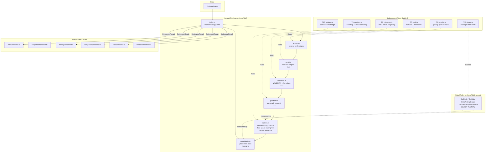

# Component Map — dot-engine-parity

```mermaid
graph TD
    subgraph Input
        DIG[DotInputGraph]
    end

    subgraph "Layout Pipeline (src/core/dot/)"
        ACY[acyclic.ts\nreverse cycle edges]
        RNK[rank.ts\nnetwork simplex\nT12]
        MIN[mincross.ts\nWMEDIAN + flat edges\nT13]
        POS[position.ts\naux graph x-coords\nT14]
        SPL[splines.ts\nobstacle polygons T16\nfree-space routing T17\nBezier fitting T18]
        ELB[edgelabels.ts\nplacement pass\nT15 NEW]
        IDX[index.ts\norchestrates pipeline]
    end

    subgraph "Data Model (src/core/dot/types.ts)"
        TYP[DotNode / DotEdge\nDotWorkingGraph\nObstaclePolygon T16 NEW\nlabelX/Y T15 NEW]
    end

    subgraph "Independent Fixes (Batch 2)"
        T6[T6: acyclic.ts\ngreedy cycle removal]
        T7[T7: rank.ts\nbalance + normalize]
        T8[T8: mincross.ts\ninit + virtual weighting]
        T9[T9: position.ts\nnodeSep + virtual centering]
        T10[T10: splines.ts\nself-loop + flat edge]
        T11[T11: types.ts\nDotEdge label fields]
    end

    subgraph "Diagram Renderers"
        CLS[class/renderer.ts]
        SEQ[sequence/renderer.ts]
        ACT[activity/renderer.ts]
        CMP[component/renderer.ts]
        STA[state/renderer.ts]
        USE[usecase/renderer.ts]
    end

    DIG --> IDX
    IDX --> ACY --> RNK --> MIN --> POS --> SPL --> ELB --> IDX
    TYP -.->|consumed by| SPL
    TYP -.->|consumed by| ELB
    IDX -->|DotLayoutResult| CLS
    IDX -->|DotLayoutResult| ACT
    IDX -->|DotLayoutResult| CMP
    IDX -->|DotLayoutResult| STA
    IDX -->|DotLayoutResult| USE

    T6 -.->|fixes| ACY
    T7 -.->|fixes| RNK
    T8 -.->|fixes| MIN
    T9 -.->|fixes| POS
    T10 -.->|fixes| SPL
    T11 -.->|extends| TYP
```
