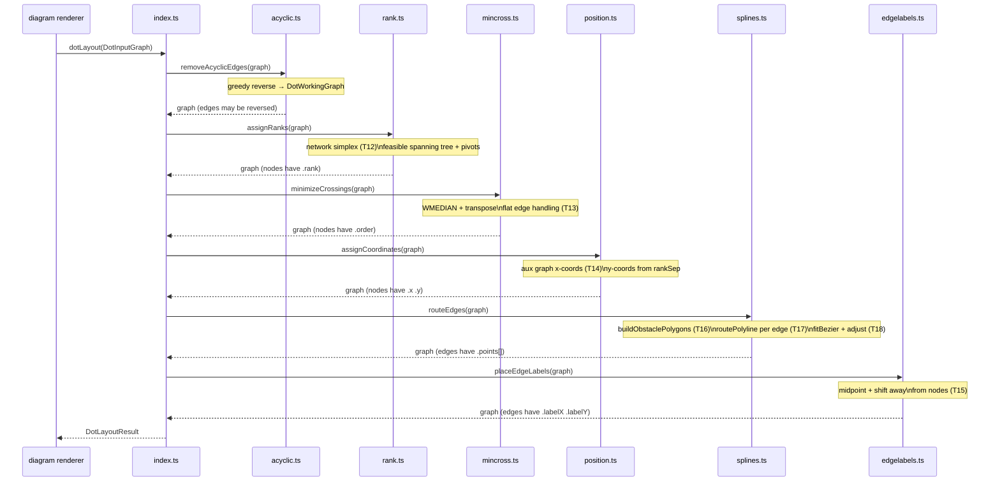
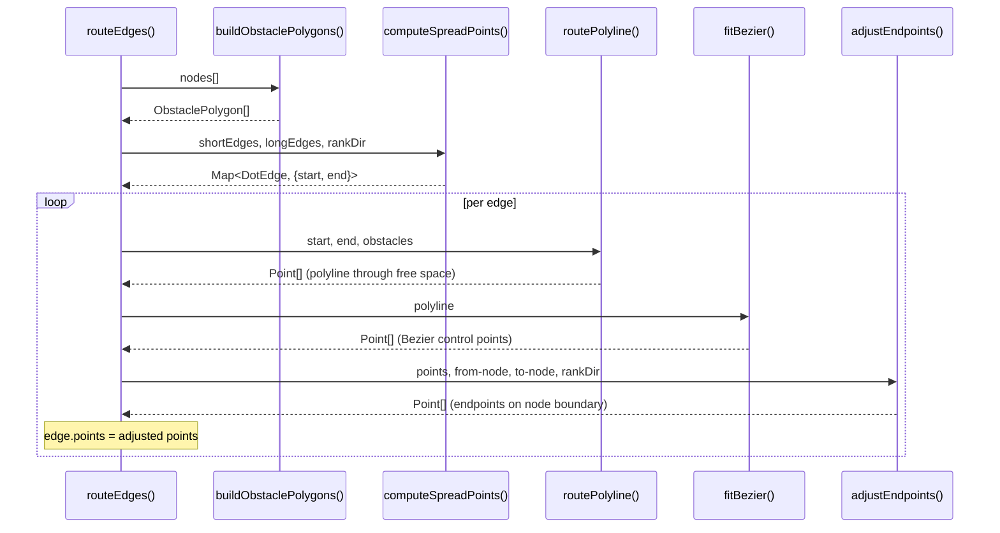
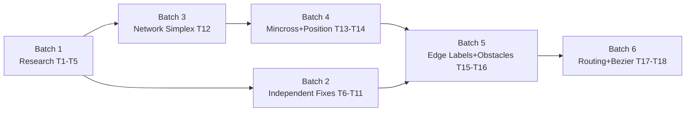

# Data Flow — dot-engine-parity

## Layout pipeline (per diagram render)

```mermaid
sequenceDiagram
    participant Caller as diagram renderer
    participant IDX as index.ts
    participant ACY as acyclic.ts
    participant RNK as rank.ts
    participant MIN as mincross.ts
    participant POS as position.ts
    participant SPL as splines.ts
    participant ELB as edgelabels.ts

    Caller->>IDX: dotLayout(DotInputGraph)
    IDX->>ACY: removeAcyclicEdges(graph)
    Note over ACY: greedy reverse → DotWorkingGraph
    ACY-->>IDX: graph (edges may be reversed)

    IDX->>RNK: assignRanks(graph)
    Note over RNK: network simplex (T12)\nfeasible spanning tree + pivots
    RNK-->>IDX: graph (nodes have .rank)

    IDX->>MIN: minimizeCrossings(graph)
    Note over MIN: WMEDIAN + transpose\nflat edge handling (T13)
    MIN-->>IDX: graph (nodes have .order)

    IDX->>POS: assignCoordinates(graph)
    Note over POS: aux graph x-coords (T14)\ny-coords from rankSep
    POS-->>IDX: graph (nodes have .x .y)

    IDX->>SPL: routeEdges(graph)
    Note over SPL: buildObstaclePolygons (T16)\nroutePolyline per edge (T17)\nfitBezier + adjust (T18)
    SPL-->>IDX: graph (edges have .points[])

    IDX->>ELB: placeEdgeLabels(graph)
    Note over ELB: midpoint + shift away\nfrom nodes (T15)
    ELB-->>IDX: graph (edges have .labelX .labelY)

    IDX-->>Caller: DotLayoutResult
```

## Spline routing sub-pipeline (T16 → T17 → T18)

```mermaid
sequenceDiagram
    participant RE as routeEdges()
    participant OBS as buildObstaclePolygons()
    participant SP as computeSpreadPoints()
    participant RT as routePolyline()
    participant BZ as fitBezier()
    participant ADJ as adjustEndpoints()

    RE->>OBS: nodes[]
    OBS-->>RE: ObstaclePolygon[]

    RE->>SP: shortEdges, longEdges, rankDir
    SP-->>RE: Map<DotEdge, {start, end}>

    loop per edge
        RE->>RT: start, end, obstacles
        RT-->>RE: Point[] (polyline through free space)
        RE->>BZ: polyline
        BZ-->>RE: Point[] (Bezier control points)
        RE->>ADJ: points, from-node, to-node, rankDir
        ADJ-->>RE: Point[] (endpoints on node boundary)
        Note over RE: edge.points = adjusted points
    end
```

## Batch dependency flow

```mermaid
graph LR
    B1[Batch 1\nResearch T1-T5] --> B2[Batch 2\nIndependent Fixes T6-T11]
    B1 --> B3[Batch 3\nNetwork Simplex T12]
    B3 --> B4[Batch 4\nMincross+Position T13-T14]
    B4 --> B5[Batch 5\nEdge Labels+Obstacles T15-T16]
    B5 --> B6[Batch 6\nRouting+Bezier T17-T18]
    B2 --> B5
```
