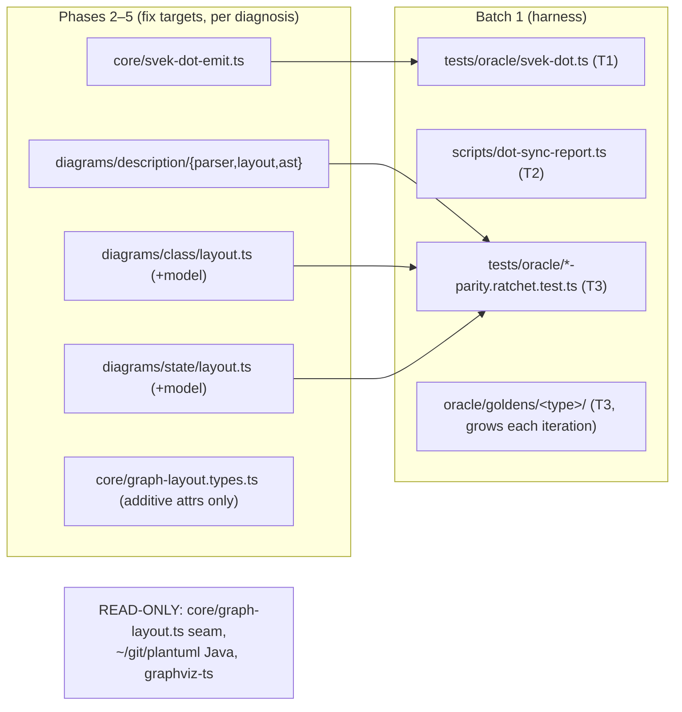

# Component map — what this mission touches

Not touched: renderers (geometry consumption unchanged), graphviz-ts,
sequence/activity/timing and other non-svek types, the visual-QA SVG tools
(parked until DOT syncs).
