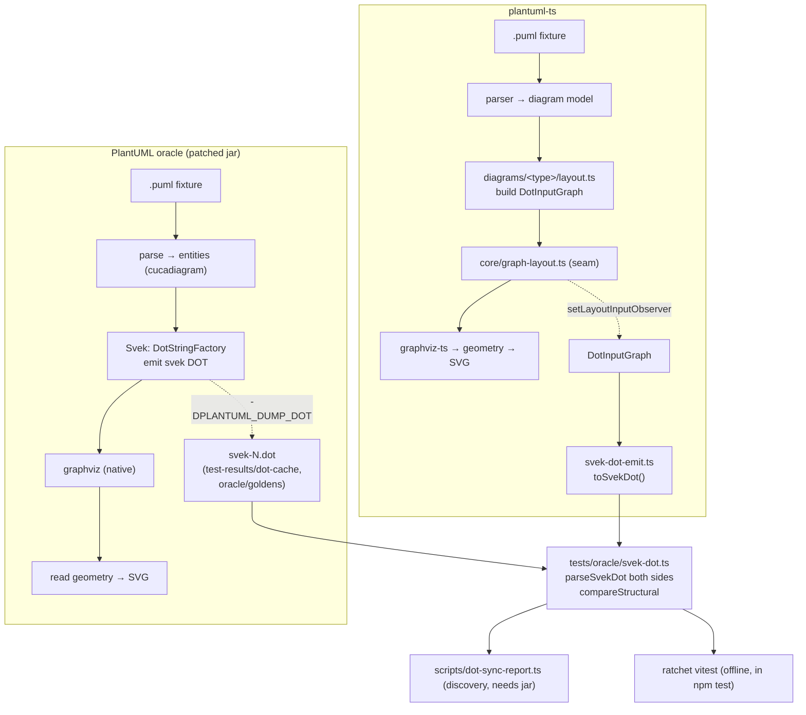

# Data flow — oracle vs ours, and where parity is measured



The DOT gate compares the two dashed taps. graphviz-ts sits BELOW the tap —
its fidelity is a separate concern (measured in ~/git/graphviz-ts itself).
```
