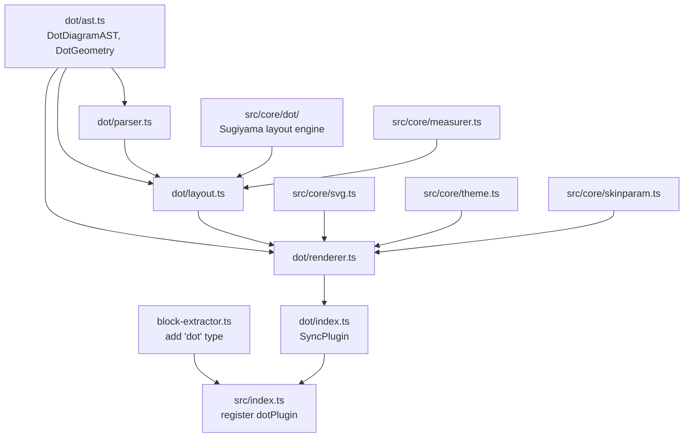

# Component Map

```mermaid
graph TD
    BE[block-extractor.ts<br/>add 'dot' type] --> IDX[src/index.ts<br/>register dotPlugin]

    AST[dot/ast.ts<br/>DotDiagramAST, DotGeometry] --> PAR[dot/parser.ts]
    AST --> LAY[dot/layout.ts]
    AST --> REN[dot/renderer.ts]

    PAR --> LAY
    LAY --> REN
    REN --> PLUG[dot/index.ts<br/>SyncPlugin]
    PLUG --> IDX

    CORE_DOT[src/core/dot/<br/>Sugiyama layout engine] --> LAY
    SVG[src/core/svg.ts] --> REN
    THEME[src/core/theme.ts] --> REN
    MEAS[src/core/measurer.ts] --> LAY
    SKIN[src/core/skinparam.ts] --> REN
```
