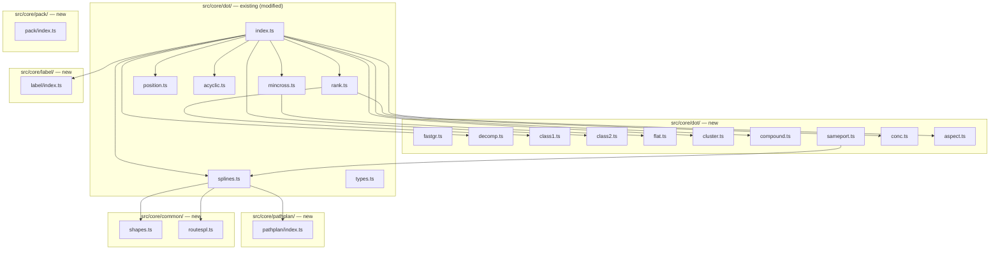
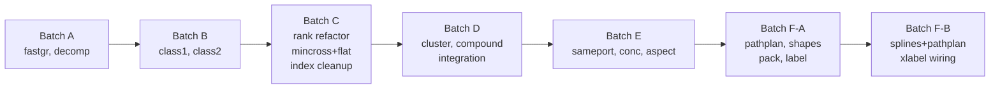

# Component Map — dot-pipeline

```mermaid
graph TD
    subgraph "src/core/dot/ — existing (modified)"
        IDX[index.ts]
        RNK[rank.ts]
        MC[mincross.ts]
        POS[position.ts]
        SPL[splines.ts]
        ACY[acyclic.ts]
        TYP[types.ts]
    end

    subgraph "src/core/dot/ — new"
        FASTGR[fastgr.ts]
        DECOMP[decomp.ts]
        C1[class1.ts]
        C2[class2.ts]
        FLAT[flat.ts]
        CLUST[cluster.ts]
        COMP[compound.ts]
        SMPRT[sameport.ts]
        CONC[conc.ts]
        ASP[aspect.ts]
    end

    subgraph "src/core/pathplan/ — new"
        PP[pathplan/index.ts]
    end

    subgraph "src/core/common/ — new"
        SHP[shapes.ts]
        RSPL[routespl.ts]
    end

    subgraph "src/core/pack/ — new"
        PCK[pack/index.ts]
    end

    subgraph "src/core/label/ — new"
        LBL[label/index.ts]
    end

    IDX --> ACY
    IDX --> DECOMP
    IDX --> CLUST
    IDX --> COMP
    IDX --> RNK
    IDX --> C2
    IDX --> MC
    IDX --> POS
    IDX --> ASP
    IDX --> SPL
    IDX --> LBL

    RNK --> C1
    RNK --> CONC
    MC --> FLAT
    SPL --> PP
    SPL --> RSPL
    SPL --> SHP
    SMPRT --> SPL
```

## Batch dependency order

```mermaid
graph LR
    A["Batch A\nfastgr, decomp"] --> B["Batch B\nclass1, class2"]
    B --> C["Batch C\nrank refactor\nmincross+flat\nindex cleanup"]
    C --> D["Batch D\ncluster, compound\nintegration"]
    D --> E["Batch E\nsameport, conc, aspect"]
    E --> FA["Batch F-A\npathplan, shapes\npack, label"]
    FA --> FB["Batch F-B\nsplines+pathplan\nxlabel wiring"]
```
