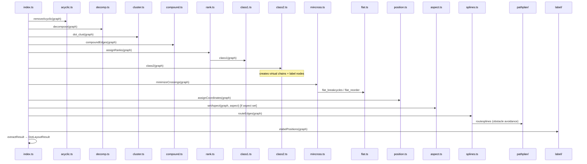
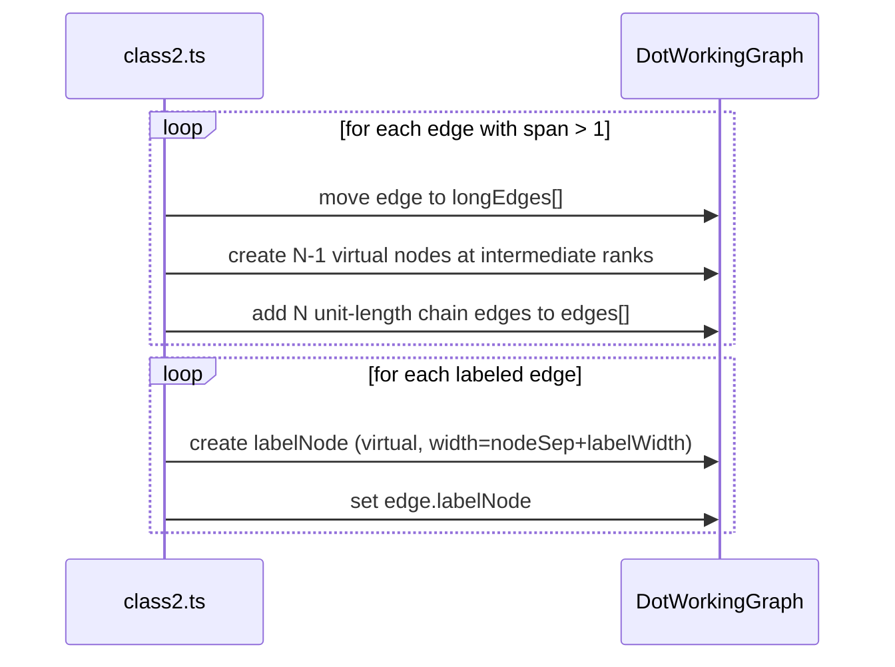

# Data Flow — dot-pipeline

## End-to-end pipeline after all tasks complete

```mermaid
sequenceDiagram
    participant I as index.ts
    participant A as acyclic.ts
    participant D as decomp.ts
    participant CL as cluster.ts
    participant CO as compound.ts
    participant R as rank.ts
    participant C1 as class1.ts
    participant C2 as class2.ts
    participant MC as mincross.ts
    participant FL as flat.ts
    participant PO as position.ts
    participant AS as aspect.ts
    participant SP as splines.ts
    participant PP as pathplan/
    participant LB as label/

    I->>A: removeAcyclic(graph)
    I->>D: decompose(graph)
    I->>CL: dot_clust(graph)
    I->>CO: compoundEdges(graph)
    I->>R: assignRanks(graph)
    R->>C1: class1(graph)
    I->>C2: class2(graph)
    Note over C2: creates virtual chains + label nodes
    I->>MC: minimizeCrossings(graph)
    MC->>FL: flat_breakcycles / flat_reorder
    I->>PO: assignCoordinates(graph)
    I->>AS: setAspect(graph, aspect) [if aspect set]
    I->>SP: routeEdges(graph)
    SP->>PP: routesplines (obstacle avoidance)
    I->>LB: xlabelPositions(graph)
    I->>I: extractResult → DotLayoutResult
```

## class2 virtual node creation (T4 key flow)

```mermaid
sequenceDiagram
    participant C2 as class2.ts
    participant G as DotWorkingGraph

    loop for each edge with span > 1
        C2->>G: move edge to longEdges[]
        C2->>G: create N-1 virtual nodes at intermediate ranks
        C2->>G: add N unit-length chain edges to edges[]
    end
    loop for each labeled edge
        C2->>G: create labelNode (virtual, width=nodeSep+labelWidth)
        C2->>G: set edge.labelNode
    end
```
