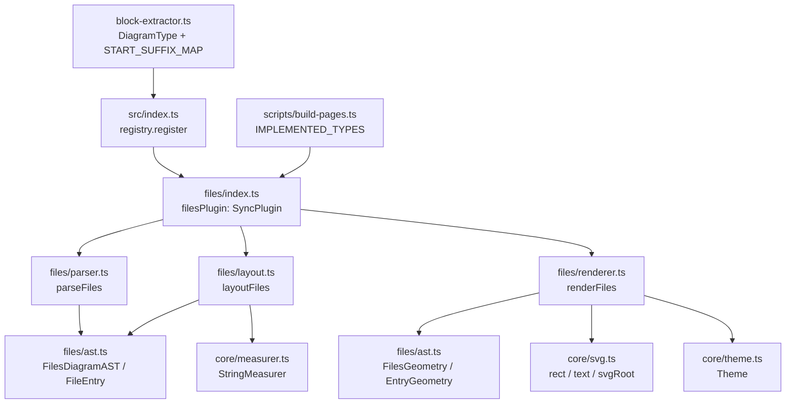

# Component Map — Files Diagram

```mermaid
graph TD
    BE[block-extractor.ts<br/>DiagramType + START_SUFFIX_MAP] --> IDX[src/index.ts<br/>registry.register]
    IDX --> PLUG[files/index.ts<br/>filesPlugin: SyncPlugin]
    PLUG --> PARSE[files/parser.ts<br/>parseFiles]
    PLUG --> LAY[files/layout.ts<br/>layoutFiles]
    PLUG --> REND[files/renderer.ts<br/>renderFiles]
    PARSE --> AST[files/ast.ts<br/>FilesDiagramAST / FileEntry]
    LAY --> AST
    LAY --> MEAS[core/measurer.ts<br/>StringMeasurer]
    REND --> GEO[files/ast.ts<br/>FilesGeometry / EntryGeometry]
    REND --> SVG[core/svg.ts<br/>rect / text / svgRoot]
    REND --> THEME[core/theme.ts<br/>Theme]
    BP[scripts/build-pages.ts<br/>IMPLEMENTED_TYPES] --> PLUG
```
