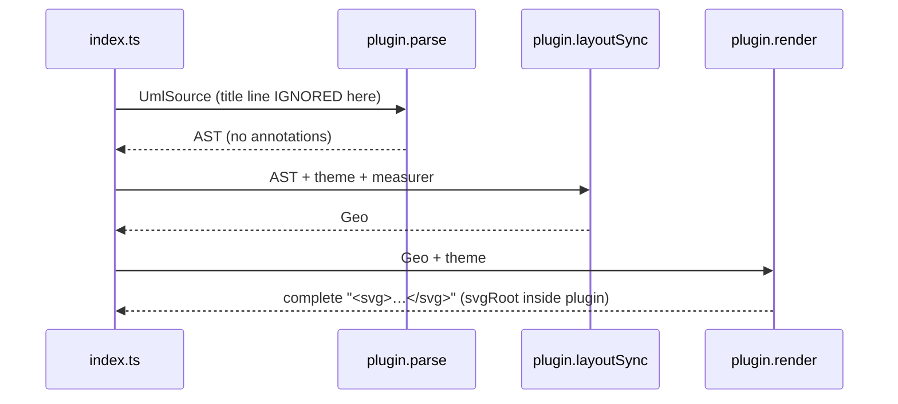

# G0b data flow — render pipeline before / after

## Before (today)



## After (G0b)

```mermaid
sequenceDiagram
    participant I as index.ts
    participant P as plugin.parse
    participant M as annotations/commands
    participant L as plugin.layoutSync
    participant R as plugin.render
    participant C as annotations/chrome
    I->>P: UmlSource
    P->>M: matchAnnotationCommand(line) at dispatch position
    M-->>P: consumed → DiagramAnnotations
    P-->>I: AST { annotations }
    I->>L: AST + theme + measurer
    L-->>I: Geo (UNCHANGED — chrome is post-layout; DOT gate untouched)
    I->>R: Geo + theme
    R-->>I: RenderFragment { body, w, h }
    I->>C: applyChrome(fragment, annotations, styles, measurer)
    Note over C: header/footer outermost →<br/>caption → title → legend → frame → body<br/>(mergeTB: width=max, height=sum)
    C-->>I: decorated RenderFragment
    I->>I: assembleSvg → svgRoot ONCE, centrally
```

Chrome wrap order (DiagramChromeFactory.create :137-149, applied inside-out):
frame → legend → title → caption → header/footer.
