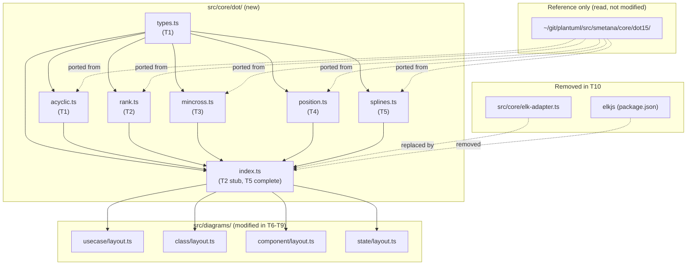

# Component Map

```mermaid
graph TD
    subgraph dot["src/core/dot/ (new)"]
        types["types.ts<br/>(T1)"]
        acyclic["acyclic.ts<br/>(T1)"]
        rank["rank.ts<br/>(T2)"]
        mincross["mincross.ts<br/>(T3)"]
        position["position.ts<br/>(T4)"]
        splines["splines.ts<br/>(T5)"]
        index["index.ts<br/>(T2 stub, T5 complete)"]
    end

    subgraph diagrams["src/diagrams/ (modified in T6-T9)"]
        uc["usecase/layout.ts"]
        cls["class/layout.ts"]
        comp["component/layout.ts"]
        st["state/layout.ts"]
    end

    subgraph removed["Removed in T10"]
        elk["src/core/elk-adapter.ts"]
        elkpkg["elkjs (package.json)"]
    end

    subgraph smetana["Reference only (read, not modified)"]
        ref["~/git/plantuml/src/smetana/core/dot15/"]
    end

    types --> acyclic
    types --> rank
    types --> mincross
    types --> position
    types --> splines
    types --> index

    acyclic --> index
    rank --> index
    mincross --> index
    position --> index
    splines --> index

    index --> uc
    index --> cls
    index --> comp
    index --> st

    elk -.->|replaced by| index
    elkpkg -.->|removed| index

    ref -.->|ported from| acyclic
    ref -.->|ported from| rank
    ref -.->|ported from| mincross
    ref -.->|ported from| position
    ref -.->|ported from| splines
```
