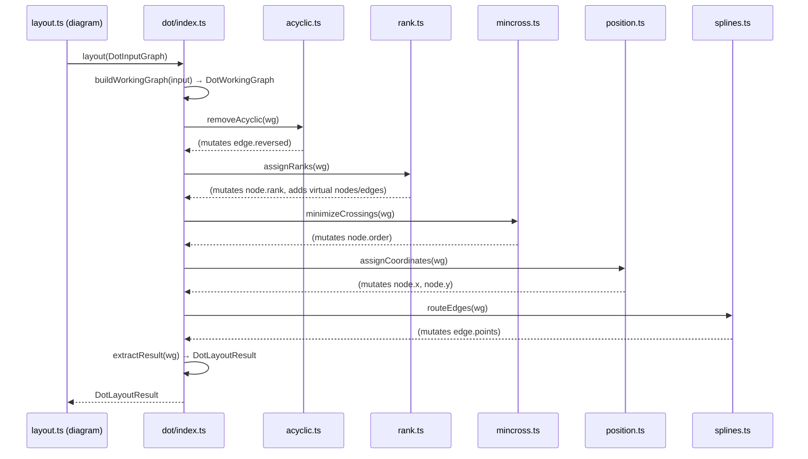
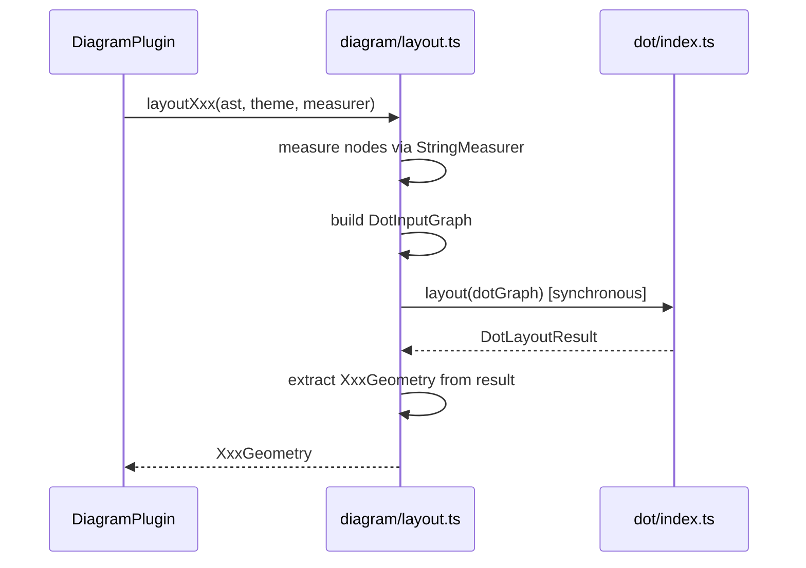

# Data Flow — dot Layout Pipeline

```mermaid
sequenceDiagram
    participant Caller as layout.ts (diagram)
    participant Index as dot/index.ts
    participant Acyclic as acyclic.ts
    participant Rank as rank.ts
    participant Mincross as mincross.ts
    participant Position as position.ts
    participant Splines as splines.ts

    Caller->>Index: layout(DotInputGraph)
    Index->>Index: buildWorkingGraph(input) → DotWorkingGraph
    Index->>Acyclic: removeAcyclic(wg)
    Acyclic-->>Index: (mutates edge.reversed)
    Index->>Rank: assignRanks(wg)
    Rank-->>Index: (mutates node.rank, adds virtual nodes/edges)
    Index->>Mincross: minimizeCrossings(wg)
    Mincross-->>Index: (mutates node.order)
    Index->>Position: assignCoordinates(wg)
    Position-->>Index: (mutates node.x, node.y)
    Index->>Splines: routeEdges(wg)
    Splines-->>Index: (mutates edge.points)
    Index->>Index: extractResult(wg) → DotLayoutResult
    Index-->>Caller: DotLayoutResult
```

## Phase 4 migration flow

```mermaid
sequenceDiagram
    participant Plugin as DiagramPlugin
    participant Layout as diagram/layout.ts
    participant Dot as dot/index.ts

    Plugin->>Layout: layoutXxx(ast, theme, measurer)
    Layout->>Layout: measure nodes via StringMeasurer
    Layout->>Layout: build DotInputGraph
    Layout->>Dot: layout(dotGraph) [synchronous]
    Dot-->>Layout: DotLayoutResult
    Layout->>Layout: extract XxxGeometry from result
    Layout-->>Plugin: XxxGeometry
```
