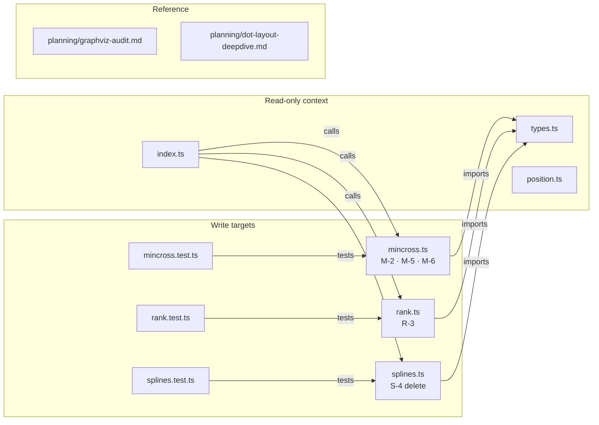

# Component Map — Files Touched

```mermaid
graph LR
    subgraph "Write targets"
        MC[mincross.ts<br/>M-2 · M-5 · M-6]
        RK[rank.ts<br/>R-3]
        SP[splines.ts<br/>S-4 delete]
        TMC[mincross.test.ts]
        TRK[rank.test.ts]
        TSP[splines.test.ts]
    end

    subgraph "Read-only context"
        TY[types.ts]
        IX[index.ts]
        PO[position.ts]
    end

    subgraph "Reference"
        AU[planning/graphviz-audit.md]
        DD[planning/dot-layout-deepdive.md]
    end

    MC -->|imports| TY
    RK -->|imports| TY
    SP -->|imports| TY
    IX -->|calls| MC
    IX -->|calls| RK
    IX -->|calls| SP
    TMC -->|tests| MC
    TRK -->|tests| RK
    TSP -->|tests| SP
```
