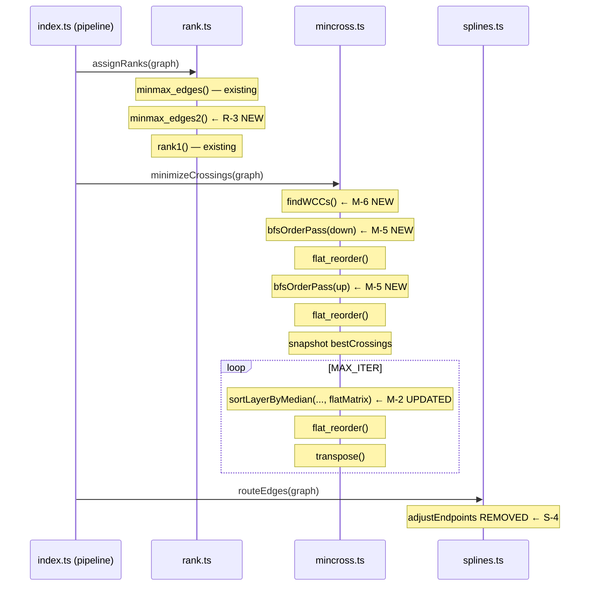

# Data Flow — Affected Pipeline Stages

```mermaid
sequenceDiagram
    participant I as index.ts (pipeline)
    participant R as rank.ts
    participant M as mincross.ts
    participant S as splines.ts

    I->>R: assignRanks(graph)
    Note over R: minmax_edges() — existing
    Note over R: minmax_edges2() ← R-3 NEW
    Note over R: rank1() — existing

    I->>M: minimizeCrossings(graph)
    Note over M: findWCCs() ← M-6 NEW
    Note over M: bfsOrderPass(down) ← M-5 NEW
    Note over M: flat_reorder()
    Note over M: bfsOrderPass(up) ← M-5 NEW
    Note over M: flat_reorder()
    Note over M: snapshot bestCrossings
    loop MAX_ITER
        Note over M: sortLayerByMedian(..., flatMatrix) ← M-2 UPDATED
        Note over M: flat_reorder()
        Note over M: transpose()
    end

    I->>S: routeEdges(graph)
    Note over S: adjustEndpoints REMOVED ← S-4
```
